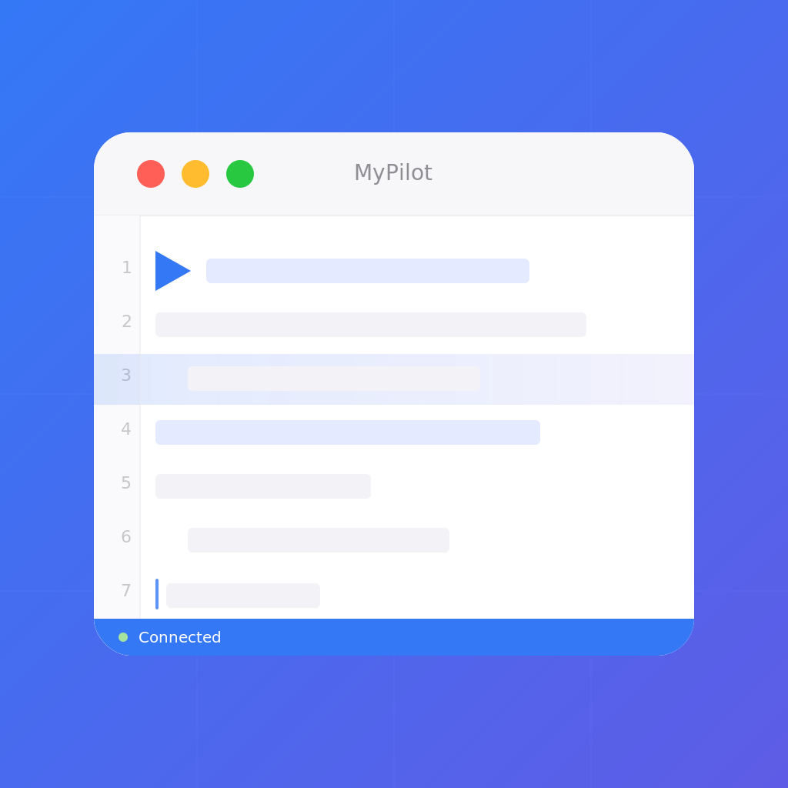
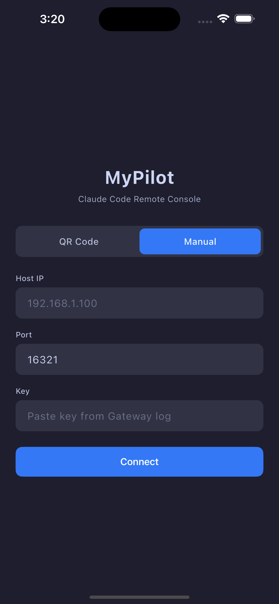
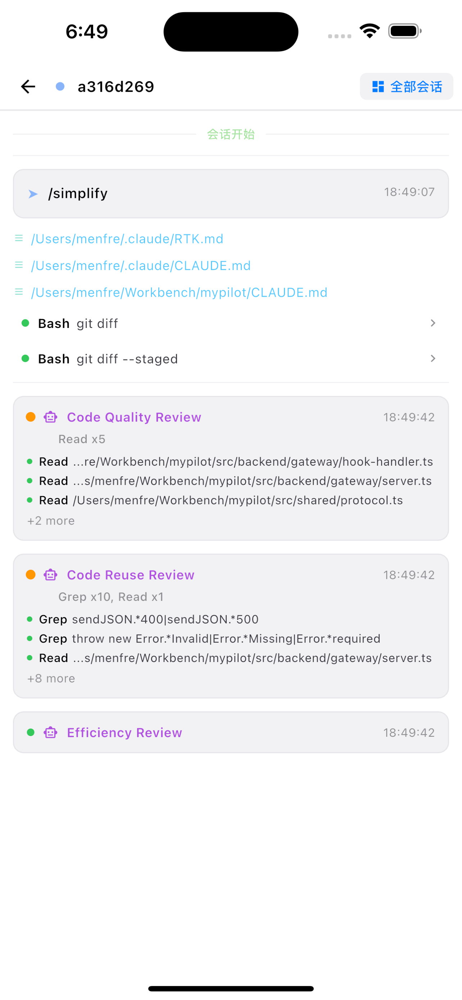
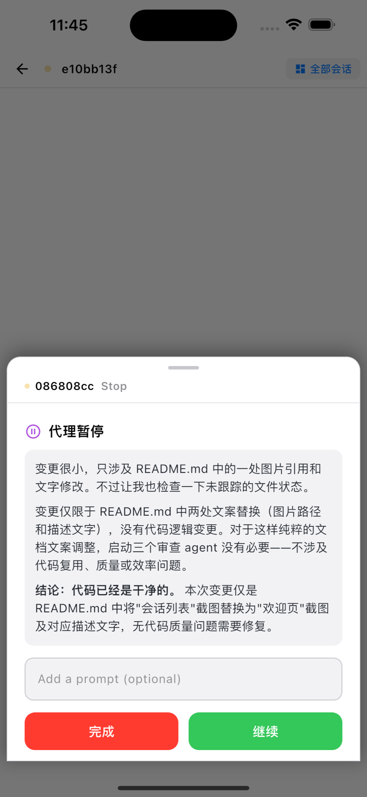

<div align="center">
  
  <h1>MyPilot</h1>

[](LICENSE)

Gateway server for [MyPilot](https://apps.apple.com/app/mypilot) — the iOS remote interaction console for Claude Code.

[中文](README.md) | English
</div>

> **Beta Testing** — MyPilot is currently in TestFlight beta. [Join the beta](https://testflight.apple.com/join/gU2Tw8Hg) to get early access.

MyPilot receives Claude Code hook events and streams them to your iPhone via WebSocket. In takeover mode, you can approve/deny permissions, answer questions, and submit prompts from your phone.

<p align="center">



</p>

<p align="center"><strong>iPhone</strong> — session list · live events · takeover mode</p>

## Requirements

- **Node.js** >= 20
- **Client**: [MyPilot iOS App](https://testflight.apple.com/join/gU2Tw8Hg) (TestFlight Beta)
- **Claude Code** CLI — [Installation guide](https://docs.anthropic.com/en/docs/claude-code/overview#installing-claude-code)

## Quick Start

```bash
# 1. Install
npm install -g mypilot

# 2. Configure Claude Code hooks
mypilot init-hooks

# 3. Start the gateway (background)
mypilot start
```

Scan the QR code displayed in your terminal with the MyPilot app on your iPhone. The QR code contains the gateway address and encryption key — everything needed for a secure connection.

## Architecture

```
Claude Code ──(command hook / curl)──▶ Gateway (:16321) ──(AES-256-GCM WebSocket)──▶ MyPilot App (device A)
                                        ├── POST /hook         ← hook event endpoint       └──▶ MyPilot App (device B)
                                        ├── GET  /pair         ← key validation
                                        └── WS   /ws-gateway   ← encrypted WebSocket (multi-device)
```

All WebSocket communication between the Gateway and the MyPilot app is end-to-end encrypted with **AES-256-GCM** using a pre-shared key distributed via QR code. The same key is used for both connection authentication and message encryption — no separate token is needed.

### Security & Reliability

- **End-to-end encryption** — AES-256-GCM with a unique random 12-byte IV per message and 16-byte authentication tag; the gateway cannot read plaintext without the key, and any tampering is detected via the auth tag
- **Key-based authentication** — clients authenticate via the pre-shared key in the WebSocket URL
- **Multi-device support** — connect multiple iPhones/iPads simultaneously; each device gets a unique `deviceId`, receives all broadcasts, and can send commands independently; same-device reconnection seamlessly replaces the old connection
- **Heartbeat** — 30-second keep-alive pings detect stale connections per device
- **Event persistence** — all events are logged to JSONL files (`~/.mypilot/logs/`)
- **Reconnection recovery** — clients can resume from the last received sequence number after reconnecting, with a per-device offline message buffer of up to 200 events

## CLI Commands

```bash
mypilot gateway                        # Start the Gateway server (foreground)
mypilot start                          # Start Gateway in background
mypilot stop                           # Stop background Gateway
mypilot restart                        # Restart Gateway (stop + start)
mypilot status                         # Check Gateway status (PID, port)
mypilot init-hooks                     # Configure Claude Code hooks (auto-merge into ~/.claude/settings.json)
mypilot pair-info                      # Show pairing info (IP + QR code) for reconnecting
mypilot link list                      # List all communication links
mypilot link add <lan|tunnel> <url>    # Add a link (LAN direct or tunnel)
mypilot link remove <id>               # Remove a link
mypilot link enable <id>               # Enable a link
mypilot link disable <id>              # Disable a link
```

## Hook Configuration

Run `mypilot init-hooks` to automatically configure all required hooks. The command:

- **Preserves** your existing hooks — only adds missing entries
- **Prompts** for confirmation before modifying `~/.claude/settings.json`
- Configures both blocking events (with timeout) and informational events

<details>
<summary>Manual configuration (advanced)</summary>

If you prefer to configure hooks manually, add the following to the `hooks` field in `~/.claude/settings.json`:

```json
{
  "hooks": {
    "PreToolUse": [
      { "matcher": "", "hooks": [{ "type": "command", "command": "curl --noproxy localhost --noproxy 127.0.0.1 -s -X POST 'http://127.0.0.1:16321/hook' -H 'Content-Type: application/json' -d @-", "timeout": 999999 }] }
    ],
    "PostToolUse": [
      { "matcher": "", "hooks": [{ "type": "command", "command": "curl --noproxy localhost --noproxy 127.0.0.1 -s -X POST 'http://127.0.0.1:16321/hook' -H 'Content-Type: application/json' -d @-" }] }
    ],
    "PostToolUseFailure": [
      { "matcher": "", "hooks": [{ "type": "command", "command": "curl --noproxy localhost --noproxy 127.0.0.1 -s -X POST 'http://127.0.0.1:16321/hook' -H 'Content-Type: application/json' -d @-" }] }
    ],
    "PermissionRequest": [
      { "matcher": "", "hooks": [{ "type": "command", "command": "curl --noproxy localhost --noproxy 127.0.0.1 -s -X POST 'http://127.0.0.1:16321/hook' -H 'Content-Type: application/json' -d @-", "timeout": 999999 }] }
    ],
    "UserPromptSubmit": [
      { "matcher": "", "hooks": [{ "type": "command", "command": "curl --noproxy localhost --noproxy 127.0.0.1 -s -X POST 'http://127.0.0.1:16321/hook' -H 'Content-Type: application/json' -d @-", "timeout": 999999 }] }
    ],
    "Elicitation": [
      { "matcher": "", "hooks": [{ "type": "command", "command": "curl --noproxy localhost --noproxy 127.0.0.1 -s -X POST 'http://127.0.0.1:16321/hook' -H 'Content-Type: application/json' -d @-", "timeout": 999999 }] }
    ],
    "Stop": [
      { "matcher": "", "hooks": [{ "type": "command", "command": "curl --noproxy localhost --noproxy 127.0.0.1 -s -X POST 'http://127.0.0.1:16321/hook' -H 'Content-Type: application/json' -d @-", "timeout": 999999 }] }
    ],
    "SubagentStop": [
      { "matcher": "", "hooks": [{ "type": "command", "command": "curl --noproxy localhost --noproxy 127.0.0.1 -s -X POST 'http://127.0.0.1:16321/hook' -H 'Content-Type: application/json' -d @-", "timeout": 999999 }] }
    ],
    "SessionStart": [
      { "matcher": "", "hooks": [{ "type": "command", "command": "curl --noproxy localhost --noproxy 127.0.0.1 -s -X POST 'http://127.0.0.1:16321/hook' -H 'Content-Type: application/json' -d @-" }] }
    ],
    "SessionEnd": [
      { "matcher": "", "hooks": [{ "type": "command", "command": "curl --noproxy localhost --noproxy 127.0.0.1 -s -X POST 'http://127.0.0.1:16321/hook' -H 'Content-Type: application/json' -d @-" }] }
    ],
    "InstructionsLoaded": [
      { "matcher": "", "hooks": [{ "type": "command", "command": "curl --noproxy localhost --noproxy 127.0.0.1 -s -X POST 'http://127.0.0.1:16321/hook' -H 'Content-Type: application/json' -d @-" }] }
    ],
    "Notification": [
      { "matcher": "", "hooks": [{ "type": "command", "command": "curl --noproxy localhost --noproxy 127.0.0.1 -s -X POST 'http://127.0.0.1:16321/hook' -H 'Content-Type: application/json' -d @-" }] }
    ],
    "SubagentStart": [
      { "matcher": "", "hooks": [{ "type": "command", "command": "curl --noproxy localhost --noproxy 127.0.0.1 -s -X POST 'http://127.0.0.1:16321/hook' -H 'Content-Type: application/json' -d @-" }] }
    ],
    "StopFailure": [
      { "matcher": "", "hooks": [{ "type": "command", "command": "curl --noproxy localhost --noproxy 127.0.0.1 -s -X POST 'http://127.0.0.1:16321/hook' -H 'Content-Type: application/json' -d @-" }] }
    ],
    "PermissionDenied": [
      { "matcher": "", "hooks": [{ "type": "command", "command": "curl --noproxy localhost --noproxy 127.0.0.1 -s -X POST 'http://127.0.0.1:16321/hook' -H 'Content-Type: application/json' -d @-" }] }
    ],
    "ConfigChange": [
      { "matcher": "", "hooks": [{ "type": "command", "command": "curl --noproxy localhost --noproxy 127.0.0.1 -s -X POST 'http://127.0.0.1:16321/hook' -H 'Content-Type: application/json' -d @-" }] }
    ],
    "CwdChanged": [
      { "matcher": "", "hooks": [{ "type": "command", "command": "curl --noproxy localhost --noproxy 127.0.0.1 -s -X POST 'http://127.0.0.1:16321/hook' -H 'Content-Type: application/json' -d @-" }] }
    ],
    "FileChanged": [
      { "matcher": "", "hooks": [{ "type": "command", "command": "curl --noproxy localhost --noproxy 127.0.0.1 -s -X POST 'http://127.0.0.1:16321/hook' -H 'Content-Type: application/json' -d @-" }] }
    ],
    "TaskCreated": [
      { "matcher": "", "hooks": [{ "type": "command", "command": "curl --noproxy localhost --noproxy 127.0.0.1 -s -X POST 'http://127.0.0.1:16321/hook' -H 'Content-Type: application/json' -d @-" }] }
    ],
    "TaskCompleted": [
      { "matcher": "", "hooks": [{ "type": "command", "command": "curl --noproxy localhost --noproxy 127.0.0.1 -s -X POST 'http://127.0.0.1:16321/hook' -H 'Content-Type: application/json' -d @-" }] }
    ],
    "TeammateIdle": [
      { "matcher": "", "hooks": [{ "type": "command", "command": "curl --noproxy localhost --noproxy 127.0.0.1 -s -X POST 'http://127.0.0.1:16321/hook' -H 'Content-Type: application/json' -d @-" }] }
    ],
    "ElicitationResult": [
      { "matcher": "", "hooks": [{ "type": "command", "command": "curl --noproxy localhost --noproxy 127.0.0.1 -s -X POST 'http://127.0.0.1:16321/hook' -H 'Content-Type: application/json' -d @-" }] }
    ],
    "WorktreeCreate": [
      { "matcher": "", "hooks": [{ "type": "command", "command": "curl --noproxy localhost --noproxy 127.0.0.1 -s -X POST 'http://127.0.0.1:16321/hook' -H 'Content-Type: application/json' -d @-" }] }
    ],
    "WorktreeRemove": [
      { "matcher": "", "hooks": [{ "type": "command", "command": "curl --noproxy localhost --noproxy 127.0.0.1 -s -X POST 'http://127.0.0.1:16321/hook' -H 'Content-Type: application/json' -d @-" }] }
    ],
    "PreCompact": [
      { "matcher": "", "hooks": [{ "type": "command", "command": "curl --noproxy localhost --noproxy 127.0.0.1 -s -X POST 'http://127.0.0.1:16321/hook' -H 'Content-Type: application/json' -d @-" }] }
    ],
    "PostCompact": [
      { "matcher": "", "hooks": [{ "type": "command", "command": "curl --noproxy localhost --noproxy 127.0.0.1 -s -X POST 'http://127.0.0.1:16321/hook' -H 'Content-Type: application/json' -d @-" }] }
    ]
  }
}
```

Events with `timeout: 999999` are blocking events that may need user interaction. See [Hook documentation](https://code.claude.com/docs/en/hooks) for details.

</details>

## Working Modes

### Bystander Mode (default)

All hook events are streamed to the app. Events return `{}` immediately — Claude Code is unaffected.

### Takeover Mode

User interaction events (PermissionRequest, Stop, Elicitation) block until you respond in the MyPilot app. Disconnect automatically returns to bystander mode.

## Pairing

When you start the gateway, a QR code is displayed in the terminal. Open the MyPilot app and scan it to connect.

If you need to reconnect later (e.g., app was closed), run:

```bash
mypilot pair-info
```

This displays the pairing QR code and connection details (IP, port, key) without restarting the gateway.

### NAT Traversal

If your iPhone is not on the same LAN (e.g., using a tunnel service like frp, ngrok, Cloudflare Tunnel), add a tunnel link:

```bash
mypilot link add tunnel wss://tunnel.example.com/ws-gateway --label "My Tunnel"
```

The QR code will automatically include the tunnel address, allowing the iOS app to connect through the tunnel.

## Docker

```bash
docker compose build
# Set LAN_IP to your machine's local IP (the iPhone must be on the same network)
LAN_IP=192.168.x.x docker compose up -d
```

The `LAN_IP` variable tells the gateway which IP address to advertise in the QR code. Without it, the QR code may contain an incorrect or unreachable address inside Docker.

## Development

```bash
npm install
npm run dev              # tsx dev server (hot reload)
npm run stop:dev         # Stop dev server
npm run restart:dev      # Restart dev server
npm run build            # tsc compile
npm run typecheck        # Type check only
npm test                 # vitest

# Docker
npm run docker:build     # Build Docker image
npm run docker:up        # Start container (auto-detect LAN_IP)
npm run docker:down      # Stop container
npm run docker:restart   # Rebuild & restart
```

## Troubleshooting

| Problem | Solution |
|---------|----------|
| Gateway won't start | Check if already running: `mypilot status`. Kill stale process if needed. |
| QR code won't scan | Ensure iPhone and computer are on the same WiFi network. Try `mypilot pair-info` for a fresh QR code. |
| App can't connect | Check firewall settings. Port 16321 must be open on your machine. |
| Hooks not firing | Verify hooks are in `~/.claude/settings.json`. Run `mypilot init-hooks` to reconfigure. |
| Wrong IP in QR code | Set `LAN_IP` env var or run `mypilot pair-info` after starting the gateway. For remote access, use `mypilot link add tunnel <url>` to add a tunnel link. |
| App issues or suggestions | [Open an issue](../../issues/new/choose) — bugs and feature requests for both the gateway and iOS app are welcome here. |

## Data Directory

```
~/.mypilot/
├── key              # AES-256-GCM encryption key
├── gateway.pid      # PID file for background mode
└── logs/
    └── events-YYYY-MM-DD.jsonl   # Daily event logs
```

## License

[Apache License 2.0](LICENSE)
