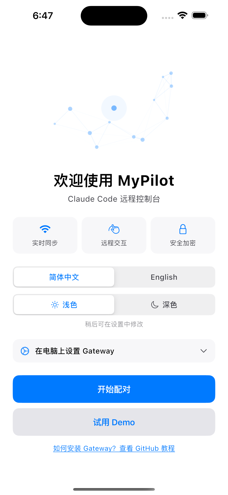

<div align="center">
  
  <h1>MyPilot</h1>

[](LICENSE)

[Claude Code](https://code.claude.com) iOS 远程交互控制台 [MyPilot](https://apps.apple.com/app/mypilot) 的网关服务。

中文 | [English](README.en.md)
</div>

> **内测邀请** — MyPilot 目前正在 TestFlight 内测中。[加入内测](https://testflight.apple.com/join/gU2Tw8Hg)抢先体验。

MyPilot 接收 Claude Code 的 Hook 事件并通过 WebSocket 实时推送到你的 iPhone。在接管模式下，你可以直接在手机上审批权限、回答问题、提交 Prompt。

<p align="center">



</p>

<p align="center"><strong>iPhone</strong> — 欢迎页 · 实时事件 · 接管模式</p>

## Web 版本

iOS App Store 审核期间，你可以使用 **[Web 版本](https://1c4908f9.mypilot.pages.dev)** 作为替代。Web 版本功能与原生应用一致，支持事件流查看和接管交互。

> **注意**：由于浏览器的 TLS 限制，Web 版本**只能通过 Relay 中继**连接网关，无法直接使用局域网地址。请先完成 [Relay 配置](#relay-中继)后再使用 Web 版本。

## 环境要求

- **Node.js** >= 20
- **客户端**：[MyPilot iOS App](https://testflight.apple.com/join/gU2Tw8Hg)（TestFlight 内测）或 [Web 版本](https://1c4908f9.mypilot.pages.dev)
- **Claude Code** CLI

## 快速开始

```bash
# 1. 安装
npm install -g mypilot

# 2. 配置 Claude Code Hooks
mypilot init-hooks

# 3. 启动网关（后台运行）
mypilot start
```

用 iPhone 上的 MyPilot 应用扫描终端中显示的二维码。二维码包含网关地址和加密密钥，连接所需的一切信息都在其中。

## 架构

```
Claude Code ──(command hook / curl)──▶ 网关 (:16321) ──(AES-256-GCM WebSocket)──▶ MyPilot App (设备 A)
                                        ├── POST /hook         ← Hook 事件接口       └──▶ MyPilot App (设备 B)
                                        ├── GET  /pair         ← 密钥验证
                                        └── WS   /ws-gateway   ← 加密 WebSocket（多设备）
```

网关与 MyPilot 应用之间的所有 WebSocket 通信均使用 **AES-256-GCM** 端到端加密，密钥通过二维码分发。同一密钥同时用于连接认证和消息加密，无需单独的 Token。

### 安全与可靠性

- **端到端加密** — AES-256-GCM，每条消息使用独立的随机 12 字节 IV 和 16 字节认证标签；网关在没有密钥的情况下无法读取明文，任何篡改都会通过认证标签被检测
- **密钥认证** — 客户端通过 WebSocket URL 中的预共享密钥进行身份验证
- **多设备支持** — 可同时连接多台 iPhone/iPad；每台设备获得唯一的 `deviceId`，接收所有广播，并可独立发送命令；同设备重连会无缝替换旧连接
- **心跳检测** — 30 秒间隔的 keep-alive ping 自动检测每台设备的失效连接
- **事件持久化** — 所有事件以 JSONL 格式记录到 `~/.mypilot/logs/`
- **断线恢复** — 客户端重连后可从上次收到的序列号继续接收，每台设备的离线消息缓冲区最多保存 200 条事件

## CLI 命令

```bash
mypilot gateway                        # 启动网关服务（前台运行）
mypilot start                          # 后台启动网关
mypilot stop                           # 停止后台网关
mypilot status                         # 查看网关状态（PID、端口）
mypilot init-hooks                     # 配置 Claude Code Hooks（自动合并到 ~/.claude/settings.json）
mypilot pair-info                      # 显示配对信息（IP + 二维码），用于重新连接
mypilot pair-info my.domain.com        # 使用自定义域名（NAT 穿透），端口默认 443
mypilot pair-info my.domain.com:8080   # 自定义域名 + 端口
```

## Hook 配置

运行 `mypilot init-hooks` 自动配置所有必需的 Hooks。该命令会：

- **保留**已有的 Hooks 配置，仅添加缺失的条目
- 修改 `~/.claude/settings.json` 前**提示**确认
- 同时配置阻塞事件（带超时）和信息事件

<details>
<summary>手动配置（高级）</summary>

如果你希望手动配置 Hooks，请在 `~/.claude/settings.json` 的 `hooks` 字段中添加：

```json
{
  "hooks": {
    "PreToolUse": [
      { "matcher": "", "hooks": [{ "type": "command", "command": "curl --noproxy localhost --noproxy 127.0.0.1 -s -X POST 'http://127.0.0.1:16321/hook' -H 'Content-Type: application/json' -d @-", "timeout": 999999 }] }
    ],
    "PostToolUse": [
      { "matcher": "", "hooks": [{ "type": "command", "command": "curl --noproxy localhost --noproxy 127.0.0.1 -s -X POST 'http://127.0.0.1:16321/hook' -H 'Content-Type: application/json' -d @-" }] }
    ],
    "PostToolUseFailure": [
      { "matcher": "", "hooks": [{ "type": "command", "command": "curl --noproxy localhost --noproxy 127.0.0.1 -s -X POST 'http://127.0.0.1:16321/hook' -H 'Content-Type: application/json' -d @-" }] }
    ],
    "PermissionRequest": [
      { "matcher": "", "hooks": [{ "type": "command", "command": "curl --noproxy localhost --noproxy 127.0.0.1 -s -X POST 'http://127.0.0.1:16321/hook' -H 'Content-Type: application/json' -d @-", "timeout": 999999 }] }
    ],
    "UserPromptSubmit": [
      { "matcher": "", "hooks": [{ "type": "command", "command": "curl --noproxy localhost --noproxy 127.0.0.1 -s -X POST 'http://127.0.0.1:16321/hook' -H 'Content-Type: application/json' -d @-", "timeout": 999999 }] }
    ],
    "Elicitation": [
      { "matcher": "", "hooks": [{ "type": "command", "command": "curl --noproxy localhost --noproxy 127.0.0.1 -s -X POST 'http://127.0.0.1:16321/hook' -H 'Content-Type: application/json' -d @-", "timeout": 999999 }] }
    ],
    "Stop": [
      { "matcher": "", "hooks": [{ "type": "command", "command": "curl --noproxy localhost --noproxy 127.0.0.1 -s -X POST 'http://127.0.0.1:16321/hook' -H 'Content-Type: application/json' -d @-", "timeout": 999999 }] }
    ],
    "SubagentStop": [
      { "matcher": "", "hooks": [{ "type": "command", "command": "curl --noproxy localhost --noproxy 127.0.0.1 -s -X POST 'http://127.0.0.1:16321/hook' -H 'Content-Type: application/json' -d @-", "timeout": 999999 }] }
    ],
    "SessionStart": [
      { "matcher": "", "hooks": [{ "type": "command", "command": "curl --noproxy localhost --noproxy 127.0.0.1 -s -X POST 'http://127.0.0.1:16321/hook' -H 'Content-Type: application/json' -d @-" }] }
    ],
    "SessionEnd": [
      { "matcher": "", "hooks": [{ "type": "command", "command": "curl --noproxy localhost --noproxy 127.0.0.1 -s -X POST 'http://127.0.0.1:16321/hook' -H 'Content-Type: application/json' -d @-" }] }
    ],
    "InstructionsLoaded": [
      { "matcher": "", "hooks": [{ "type": "command", "command": "curl --noproxy localhost --noproxy 127.0.0.1 -s -X POST 'http://127.0.0.1:16321/hook' -H 'Content-Type: application/json' -d @-" }] }
    ],
    "Notification": [
      { "matcher": "", "hooks": [{ "type": "command", "command": "curl --noproxy localhost --noproxy 127.0.0.1 -s -X POST 'http://127.0.0.1:16321/hook' -H 'Content-Type: application/json' -d @-" }] }
    ],
    "SubagentStart": [
      { "matcher": "", "hooks": [{ "type": "command", "command": "curl --noproxy localhost --noproxy 127.0.0.1 -s -X POST 'http://127.0.0.1:16321/hook' -H 'Content-Type: application/json' -d @-" }] }
    ],
    "StopFailure": [
      { "matcher": "", "hooks": [{ "type": "command", "command": "curl --noproxy localhost --noproxy 127.0.0.1 -s -X POST 'http://127.0.0.1:16321/hook' -H 'Content-Type: application/json' -d @-" }] }
    ],
    "PermissionDenied": [
      { "matcher": "", "hooks": [{ "type": "command", "command": "curl --noproxy localhost --noproxy 127.0.0.1 -s -X POST 'http://127.0.0.1:16321/hook' -H 'Content-Type: application/json' -d @-" }] }
    ],
    "ConfigChange": [
      { "matcher": "", "hooks": [{ "type": "command", "command": "curl --noproxy localhost --noproxy 127.0.0.1 -s -X POST 'http://127.0.0.1:16321/hook' -H 'Content-Type: application/json' -d @-" }] }
    ],
    "CwdChanged": [
      { "matcher": "", "hooks": [{ "type": "command", "command": "curl --noproxy localhost --noproxy 127.0.0.1 -s -X POST 'http://127.0.0.1:16321/hook' -H 'Content-Type: application/json' -d @-" }] }
    ],
    "FileChanged": [
      { "matcher": "", "hooks": [{ "type": "command", "command": "curl --noproxy localhost --noproxy 127.0.0.1 -s -X POST 'http://127.0.0.1:16321/hook' -H 'Content-Type: application/json' -d @-" }] }
    ],
    "TaskCreated": [
      { "matcher": "", "hooks": [{ "type": "command", "command": "curl --noproxy localhost --noproxy 127.0.0.1 -s -X POST 'http://127.0.0.1:16321/hook' -H 'Content-Type: application/json' -d @-" }] }
    ],
    "TaskCompleted": [
      { "matcher": "", "hooks": [{ "type": "command", "command": "curl --noproxy localhost --noproxy 127.0.0.1 -s -X POST 'http://127.0.0.1:16321/hook' -H 'Content-Type: application/json' -d @-" }] }
    ],
    "TeammateIdle": [
      { "matcher": "", "hooks": [{ "type": "command", "command": "curl --noproxy localhost --noproxy 127.0.0.1 -s -X POST 'http://127.0.0.1:16321/hook' -H 'Content-Type: application/json' -d @-" }] }
    ],
    "ElicitationResult": [
      { "matcher": "", "hooks": [{ "type": "command", "command": "curl --noproxy localhost --noproxy 127.0.0.1 -s -X POST 'http://127.0.0.1:16321/hook' -H 'Content-Type: application/json' -d @-" }] }
    ],
    "WorktreeCreate": [
      { "matcher": "", "hooks": [{ "type": "command", "command": "curl --noproxy localhost --noproxy 127.0.0.1 -s -X POST 'http://127.0.0.1:16321/hook' -H 'Content-Type: application/json' -d @-" }] }
    ],
    "WorktreeRemove": [
      { "matcher": "", "hooks": [{ "type": "command", "command": "curl --noproxy localhost --noproxy 127.0.0.1 -s -X POST 'http://127.0.0.1:16321/hook' -H 'Content-Type: application/json' -d @-" }] }
    ],
    "PreCompact": [
      { "matcher": "", "hooks": [{ "type": "command", "command": "curl --noproxy localhost --noproxy 127.0.0.1 -s -X POST 'http://127.0.0.1:16321/hook' -H 'Content-Type: application/json' -d @-" }] }
    ],
    "PostCompact": [
      { "matcher": "", "hooks": [{ "type": "command", "command": "curl --noproxy localhost --noproxy 127.0.0.1 -s -X POST 'http://127.0.0.1:16321/hook' -H 'Content-Type: application/json' -d @-" }] }
    ]
  }
}
```

带有 `timeout: 999999` 的事件为阻塞事件，可能需要用户交互。详见 [Hook 文档](https://code.claude.com/docs/en/hooks)。

</details>

## 工作模式

### 旁观模式（默认）

所有 Hook 事件实时推送到应用，事件立即返回 `{}`，不影响 Claude Code 运行。

### 接管模式

需要用户交互的事件（PermissionRequest、Stop、Elicitation）会阻塞，等待你在 MyPilot 应用中响应。断开连接后自动恢复为旁观模式。

## 配对

启动网关时，终端会显示二维码。打开 MyPilot 应用扫描即可连接。

如需重新连接（例如应用已关闭），运行：

```bash
mypilot pair-info
```

此命令会显示配对二维码和连接详情（IP、端口、密钥），无需重启网关。

### NAT 穿透

如果你的 iPhone 不在同一局域网（例如使用了 frp、ngrok、Cloudflare Tunnel 等隧道服务），请提供你的域名：

```bash
mypilot pair-info tunnel.example.com        # 默认端口 443
mypilot pair-info tunnel.example.com:8080   # 自定义端口
```

二维码将使用域名作为主机地址，使 iOS 应用能够通过隧道连接。

### Relay 中继

Relay 通过 Cloudflare Worker 在网关和客户端之间中继 WebSocket 连接，适用于以下场景：

- **Web 版本**：浏览器由于 TLS 限制只能通过 Relay 连接
- **跨网络访问**：iPhone 不在同一局域网，且没有搭建隧道服务
- **快速上手**：无需配置域名或端口转发即可远程使用

#### 工作原理

```
Gateway ──(WSS + AES-256-GCM)──▶ Cloudflare Worker ──(WSS)──▶ Web App / iOS App
```

Relay 仅转发加密后的消息，无法读取明文内容。

#### 部署 Cloudflare Worker

1. 进入 `cloudflare-worker/` 目录：

```bash
cd cloudflare-worker
npm install
```

2. 登录 Wrangler 并部署：

```bash
npx wrangler login
npx wrangler deploy
```

3. 记下部署后输出的 Worker URL（例如 `wss://mypilot-relay.<your-subdomain>.workers.dev`）

4. 将网关密钥设置为 Worker 环境变量：

```bash
# 读取本地密钥
cat ~/.mypilot/key

# 设置为 Worker Secret（输入上一步读取的密钥值）
npx wrangler secret put GATEWAY_KEY
```

#### 配置网关使用 Relay

```bash
# 添加 Relay 连接
mypilot link add cloudflare wss://mypilot-relay.<your-subdomain>.workers.dev --label "My Relay"

# 查看已配置的连接
mypilot link list

# 启动网关（自动连接到 Relay）
mypilot start
```

网关启动后会自动通过 Relay 广播，客户端扫描二维码即可连接。二维码会自动包含 Relay 地址。

#### 管理连接

```bash
mypilot link list              # 列出所有连接
mypilot link remove <id>       # 移除连接
mypilot link enable <id>       # 启用连接
mypilot link disable <id>      # 禁用连接
```

## Docker

```bash
docker compose build
# 设置 LAN_IP 为本机局域网 IP（iPhone 必须在同一网络）
LAN_IP=192.168.x.x docker compose up -d
```

`LAN_IP` 变量指定网关在二维码中广播的 IP 地址。若不设置，二维码可能包含 Docker 内部不可达的地址。

## 开发

```bash
npm install
npm run dev              # tsx 开发服务器（热重载）
npm run stop:dev         # 停止开发服务器
npm run restart:dev      # 重启开发服务器
npm run build            # tsc 编译
npm run typecheck        # 仅类型检查
npm test                 # vitest 测试

# Docker
npm run docker:build     # 构建 Docker 镜像
npm run docker:up        # 启动容器（自动检测 LAN_IP）
npm run docker:down      # 停止容器
npm run docker:restart   # 重新构建并重启
```

## 故障排除

| 问题 | 解决方案 |
|------|----------|
| 网关无法启动 | 检查是否已在运行：`mypilot status`。必要时终止残留进程。 |
| 二维码无法扫描 | 确保 iPhone 和电脑在同一 WiFi 网络。尝试 `mypilot pair-info` 获取新的二维码。 |
| 应用无法连接 | 检查防火墙设置，确保本机 16321 端口开放。 |
| Hook 未触发 | 检查 `~/.claude/settings.json` 中的配置。运行 `mypilot init-hooks` 重新配置。 |
| 二维码中 IP 不正确 | 设置 `LAN_IP` 环境变量，或启动网关后运行 `mypilot pair-info`。远程访问请使用 `mypilot pair-info <域名>`。 |
| Web 版本无法连接 | Web 版本必须通过 Relay 连接。请先完成 [Relay 配置](#relay-中继)，确保 `mypilot link list` 显示已启用的 cloudflare 连接。 |
| Relay 连接断开 | 网关会自动重连。如持续失败，检查 Worker URL 是否正确、`GATEWAY_KEY` 是否与本地密钥一致。 |
| App 问题或建议 | [提交 Issue](../../issues/new/choose) — 网关和 iOS App 的问题与建议均欢迎在此反馈。 |

## 数据目录

```
~/.mypilot/
├── key              # AES-256-GCM 加密密钥
├── gateway.pid      # 后台模式的 PID 文件
└── logs/
    └── events-YYYY-MM-DD.jsonl   # 按天存储的事件日志
```

## 许可证

[Apache License 2.0](LICENSE)
