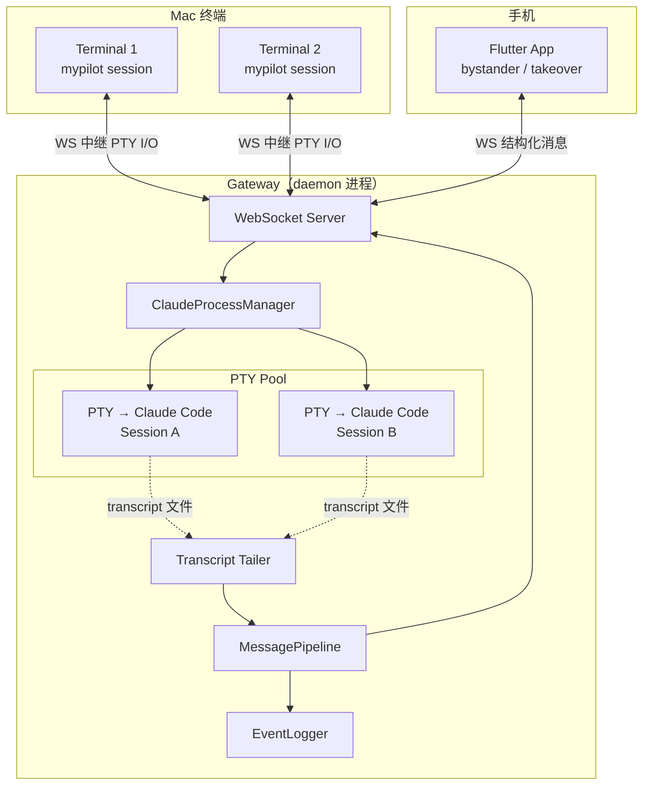
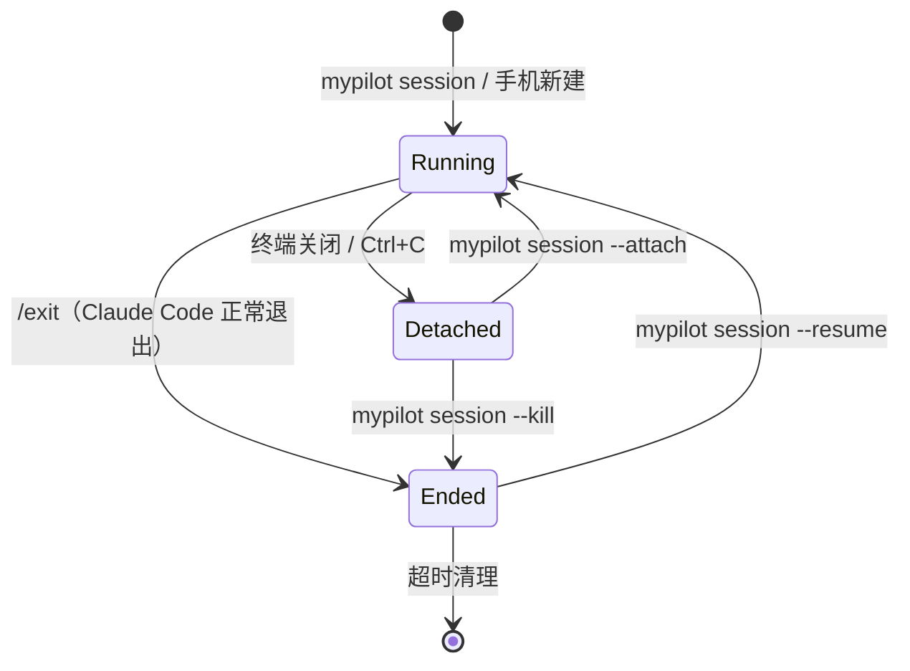

# 主动会话系统设计方案

## 1. 背景与目标

### 1.1 现状问题

当前 MyPilot 是被动的会话观察者：

```
桌面终端 → claude（独立进程）→ HTTP hook → MyPilot → WebSocket → 手机
                              → transcript 文件 → tailer ↗
```

限制：

- 手机端用户**无法主动发起 session**
- 手机端用户**无法主动发送 prompt**（只能响应阻断式交互）
- 关闭终端 = session 死亡，无法在手机端继续

### 1.2 目标

- 手机端可以**主动创建** session 并发送 prompt
- Mac 终端与手机之间**无缝流转**（关闭终端不中断 session）
- 保持手机端**bystander 模式**为默认姿态，主动交互为 takeover 模式的增强
- 不改动 Claude Code 原生行为，利用其 session 持久化能力

---

## 2. 架构概览

### 2.1 核心变化

**之前**：CLI 进程持有 PTY，关闭终端 = PTY 销毁 = Claude Code 被 SIGHUP 杀死

**之后**：Gateway daemon 持有所有 PTY，终端只是 attach/detach 的 viewer（类似 tmux）



### 2.2 两种运行模式

| | PTY 模式（Mac 桌面） | Headless 模式（手机启动） |
|---|---|---|
| 启动方 | `mypilot session` 命令 | 手机 App "新建会话" |
| Claude Code 参数 | 无特殊参数（完整 TUI） | `--print --verbose --input-format stream-json --output-format stream-json --include-hook-events` |
| 桌面体验 | 完整 Claude Code TUI | 无 |
| 手机体验 | transcript 结构化数据 | stream-json 结构化数据 |
| stdin 来源 | 终端键盘 / 手机 WebSocket | 手机 WebSocket |
| 进程持有者 | Gateway daemon | Gateway daemon |

---

## 3. stream-json 与现有协议格式兼容性

### 3.1 实际输出采样

以 `--output-format stream-json --include-hook-events` 启动 Claude Code，发送 "list files in current directory"：

**assistant 消息（thinking / text / tool_use）**：

```json
{"type":"assistant","message":{"id":"...","type":"message","role":"assistant","content":[{"type":"thinking","thinking":"...","signature":"..."}],"model":"deepseek-v4-pro","usage":{"input_tokens":33264}},"parent_tool_use_id":null,"session_id":"...","uuid":"..."}

{"type":"assistant","message":{"id":"...","type":"message","role":"assistant","content":[{"type":"tool_use","id":"call_00_...","name":"Bash","input":{"command":"ls -la","description":"..."}}],"model":"deepseek-v4-pro","usage":{"input_tokens":33264}},"parent_tool_use_id":null,"session_id":"...","uuid":"..."}

{"type":"assistant","message":{"id":"...","type":"message","role":"assistant","content":[{"type":"text","text":"..."}],"model":"deepseek-v4-pro","usage":{"input_tokens":33264}},"parent_tool_use_id":null,"session_id":"...","uuid":"..."}
```

**user 消息（tool_result）**：

```json
{"type":"user","message":{"role":"user","content":[{"tool_use_id":"call_00_...","type":"tool_result","content":"...","is_error":false}]},"parent_tool_use_id":null,"session_id":"...","uuid":"..."}
```

**system 消息（hook 事件）**：

```json
{"type":"system","subtype":"hook_started","hook_id":"...","hook_name":"SessionStart:startup","hook_event":"SessionStart","session_id":"...","uuid":"..."}

{"type":"system","subtype":"hook_response","hook_id":"...","hook_name":"SessionStart:startup","hook_event":"SessionStart","output":"{}",...}

{"type":"system","subtype":"init","cwd":"...","session_id":"...","tools":[...],"model":"...",...}
```

**result 消息**：

```json
{"type":"result","subtype":"success","session_id":"...","usage":{...},"modelUsage":{...},"duration_ms":5175,...}
```

### 3.2 与现有 TranscriptEntry 的对比

现有 `TranscriptReader.classifyEntry()` 解析 transcript 文件中的 JSONL 行（`src/backend/gateway/transcript-reader.ts:206`）：

```typescript
export function classifyEntry(entry: JsonEntry): ParsedEntry | null {
  const type = entry.type as string | undefined;
  if (type !== 'assistant' && type !== 'user') return null;
  // 解析 message.content 中的 thinking / text / tool_use / tool_result 块
}
```

对比结论：**stream-json 的 assistant/user 消息与 transcript 文件格式完全相同**。`type`、`message.content`、`message.model`、`message.usage` 字段一一对应。

| 字段 | transcript 文件 | stream-json 输出 | 一致性 |
|------|----------------|-----------------|--------|
| `type` | `"assistant" \| "user"` | 同 | ✓ |
| `message.id` | string | 同 | ✓ |
| `message.role` | `"assistant" \| "user"` | 同 | ✓ |
| `message.content[].type` | `thinking\|text\|tool_use\|tool_result` | 同 | ✓ |
| `message.model` | string | 同 | ✓ |
| `message.usage` | TokenUsage | 同 | ✓ |
| `session_id` | ✓ | ✓ | ✓ |

**stream-json 比 transcript 文件多的字段**（外层包装）：
- `parent_tool_use_id` — 子代理关联
- `uuid` — 消息 UUID
- `tool_use_result` — 结构化 tool result（system 消息中）

### 3.3 Hook 事件的映射

stream-json 中 hook 事件以 `system/hook_started` 形式出现，需映射到现有的 `SSEHookEvent`：

```
stream-json                          →  SSEHookEvent
────────────────────────────────────────────
hook_event: "SessionStart"           →  event_name: "SessionStart"
hook_id: "1d3b226d-..."              →  event_id: "1d3b226d-..."
session_id: "ad8906ff-..."           →  session_id: "ad8906ff-..."
timestamp (from system message)      →  timestamp: 1715080000000
```

**结论：stream-json 的输出可以直接被现有 `TranscriptReader` 解析，hook 事件只需薄适配层做字段名映射。** 现有的 `EventManager → DisplayItem → MessageFlow` 渲染管道完全无需改动。

### 3.4 新消息类型

stream-json 引入了三个现有协议不覆盖的消息类型：

| 消息类型 | 用途 | 处理方式 |
|---------|------|---------|
| `system/init` | 会话初始化信息（cwd、tools、model 等） | 提取为 SessionInfo 补充字段 |
| `system/hook_response` | hook 执行结果 | 与 `hook_started` 配对，可忽略 |
| `result` | 会话终止结果（usage、stop_reason） | 提取 usage 统计，触发 `session_end` |

---

## 4. 手机端模式：bystander 与增强 takeover

### 4.1 两种模式（保持原有命名，语义增强）

当前系统已是两种模式：`bystander` 和 `takeover`。无需增加第三种模式。

| 模式 | 原有能力 | 新增能力 |
|------|---------|---------|
| **bystander** | 观察所有 session 的消息流 | 不变 |
| **takeover** | 响应阻断式交互（权限、提问、停止） | **+ 发送主动 prompt**（点击输入框即可输入任意文本） |

### 4.2 takeover 模式下的输入栏行为

`SessionPromptBar` 已有完整的交互响应 UI（权限按钮、提问选项、停止原因输入）。现在增加一个**通用文本输入模式**：

```
takeover 模式下的输入栏状态：

状态 A：存在待处理的阻断交互
  → 显示交互响应控件（权限允许/拒绝、选项芯片等）
  → 当前行为，不变

状态 B：无待处理交互
  → 显示通用文本输入框 + 发送按钮
  → 新增：用户可输入任意 prompt
  → 发送 ClientSendPrompt 消息
```

状态 A 和 B 互斥，状态 A 优先。`SessionPromptBar` 的 UI 结构保持不变，只需增加状态 B 的渲染分支。

### 4.3 bystander 模式

完全不变。bystander 用户只看到消息流，没有输入栏。用户体验是纯粹的监视器。

---

## 5. 核心设计

### 5.1 ClaudeProcessManager

Gateway 内的新模块，管理所有 Claude Code 子进程。

```typescript
interface ClaudeProcessManager {
  // 生命周期
  spawnPTY(sessionId: string, options: SpawnOptions): void;
  spawnHeadless(sessionId: string, options: SpawnOptions): void;
  stop(sessionId: string): Promise<void>;
  kill(sessionId: string): void;

  // I/O
  write(sessionId: string, data: string): void;
  onMessage(sessionId: string, handler: (msg: StreamJsonMessage) => void): void;

  // 模式切换
  handoff(sessionId: string): Promise<void>;   // PTY → headless
  attach(sessionId: string): void;              // headless → PTY

  // 查询
  getActiveSessions(): SessionStatus[];
  getSessionMode(sessionId: string): 'pty' | 'headless' | null;
}

interface SpawnOptions {
  cwd?: string;
  model?: string;
  displayName?: string;
  resumeFrom?: string;
}

interface SessionStatus {
  sessionId: string;
  mode: 'pty' | 'headless';
  cwd: string;
  displayName?: string;
  startedAt: number;
  lastActivityAt: number;
}
```

### 5.2 消息输入适配层

新增 `StreamJsonAdapter`，负责将 stream-json 输出标准化为现有的 `SessionMessage` 格式：

```typescript
// 将 stream-json 行转换为 SessionMessage
function adaptStreamJson(line: string): SessionMessage | null {
  const msg = JSON.parse(line);

  switch (msg.type) {
    case 'assistant':
    case 'user':
      // 复用现有 TranscriptReader.classifyEntry() 解析
      const parsed = classifyEntry(msg);
      if (!parsed) return null;
      return {
        sessionId: msg.session_id,
        seq: nextSeq(),
        timestamp: parseTimestamp(msg.timestamp),
        source: 'transcript',
        entry: { index: -1, type: msg.type, ...parsed },
      };

    case 'system':
      if (msg.subtype === 'hook_started') {
        return {
          sessionId: msg.session_id,
          seq: nextSeq(),
          timestamp: Date.now(),
          source: 'hook',
          event: {
            session_id: msg.session_id,
            event_name: msg.hook_event,
            event_id: msg.hook_id,
            timestamp: Date.now(),
          },
        };
      }
      if (msg.subtype === 'init') {
        // 提取 session 元数据
        return handleInit(msg);
      }
      return null;

    case 'result':
      // 触发 session 结束处理
      return handleResult(msg);

    default:
      return null;
  }
}
```

对于 headless 模式，stream-json 的输出直接走适配层进入 `MessagePipeline`，不再需要 tail transcript 文件。

对于 PTY 模式，继续使用现有的 transcript tailer（因为 PTY 模式的 Claude Code 不输出 stream-json）。

### 5.3 PTY 终端中继

CLI 通过**本地 WebSocket** 连接 Gateway，中继终端 I/O：

```
Terminal stdin  → CLI → WS → Gateway → PTY write → Claude Code
Claude Code     → PTY read → Gateway → WS → CLI → Terminal stdout
```

CLI 中继循环伪代码：

```typescript
const ws = connectLocalWebSocket(
  `ws://127.0.0.1:${PORT}/pty-relay?sessionId=${id}&key=${key}`
);

process.stdin.on('data', (data) => ws.send(encrypt({ type: 'pty_in', data })));

ws.on('message', (msg) => {
  const { type, data } = decrypt(msg);
  if (type === 'pty_out') process.stdout.write(data);
  if (type === 'session_detached') {
    console.log('已移交给 Gateway，手机端可继续');
    process.exit(0);
  }
});
```

### 5.4 Session 生命周期



### 5.5 流转（Mac → 手机）

```
1. 终端关闭（SIGINT / SIGHUP / stdin end）
2. CLI 发送 { type: 'pty_detach', sessionId } 到 Gateway
3. Gateway 移除 CLI 的 WS 连接，PTY 继续运行
4. Gateway 广播 session_status_changed（source='mobile'）
5. 手机 App 看到 session 仍在活跃
6. 若手机处于 takeover 模式 → 可继续发 prompt（Gateway 写入 PTY）
```

**不自动切换为 headless 模式**——保持 PTY 等待 Mac 重新 attach。手机输入直接写入 PTY，与终端键盘输入等效。

### 5.6 流转（手机 → Mac）

```
1. 用户回到 Mac，执行 mypilot session --resume <id> 或 --last
2. 若 session 当前是 headless 模式 → Gateway 停止 headless 进程
3. Gateway 以 PTY 模式启动 claude --resume <id>
4. CLI 进入中继模式，用户看到完整 TUI
5. 手机可继续旁观（bystander）或接管（takeover）
```

### 5.7 多终端多 Session

Gateway 统一管理，天然支持：

```
Gateway daemon
├── Session "重构API"     PTY      ← Terminal 1 attach
├── Session "修bug"       PTY      ← Terminal 2 attach
├── Session "学习Rust"    headless ← 手机创建
└── Session "写文档"      PTY      ← 无终端 attach（detached）
```

同一 session 可被多个终端同时 attach（共享查看）：

```bash
Terminal 1: mypilot session --name "重构"
Terminal 2: mypilot session --attach 重构
```

---

## 6. 消息可靠性

流转不丢消息的三层保证：

| 保证层 | 负责方 | 机制 |
|--------|--------|------|
| AI 对话上下文 | Claude Code | `--resume` 从磁盘加载完整历史 |
| App 消息显示 | Gateway EventLogger | `~/.mypilot/logs/` JSONL 持久化 + `subscribe_session` 回放 |
| Session 标识 | Gateway | 交接时复用同一 session ID |

流转前后手机 App 看到的是**一条连续的时间线**，无断层。

交接瞬间（1-3 秒进程重启期）Gateway 发送 `session_status_changed` 事件，前端可显示"切换中"系统提示。

---

## 7. Session 终止语义

| 操作 | 行为 | 说明 |
|------|------|------|
| Claude Code TUI 中输入 `/exit` | 优雅退出 | Session 标记为 Ended，广播 `session_end` |
| 关闭终端 / Ctrl+C | 移交（detach） | PTY 继续运行在 Gateway 中 |
| `mypilot session --kill <id>` | 强制终止 | Gateway 发送 SIGTERM → 超时 5s → SIGKILL |
| `mypilot session --detach` | 显式移交 | 无需关闭终端即可移交 |

---

## 8. 协议扩展

### 8.1 Client → Gateway（新增消息类型）

```typescript
// 增强 ClientMessage 联合类型
type ClientMessage =
  | { type: 'takeover' }
  | { type: 'release' }
  | { type: 'interact'; sessionId: string; eventId: string; response: InteractionResponse }
  | { type: 'start_session'; cwd?: string; model?: string; displayName?: string }       // 新增
  | { type: 'send_prompt'; sessionId: string; prompt: string }                           // 新增
  | { type: 'stop_session'; sessionId: string }                                          // 新增
  | { type: 'request_sessions'; lastEventSeq?: number }
  | { type: 'delete_session'; sessionId: string }
  | // ... 其余不变
```

`takeover` 消息语义不变，但现在 takeover 成功后获得完整控制权（响应交互 + 发送 prompt）。

`start_session` 不指定启动模式，由 Gateway 根据来源推断：CLI 发起 → PTY 模式，手机发起 → headless 模式。

### 8.2 Gateway → Client（新增消息类型）

```typescript
// 增强 GatewayMessage 联合类型
type GatewayMessage =
  | // ... 现有类型不变
  | { type: 'session_status_changed'; sessionId: string; source: 'desktop' | 'mobile' | 'detached' }
```

### 8.3 SessionInfo 扩展

```typescript
interface SessionInfo {
  id: string;
  color: string;
  colorIndex: number;
  startedAt: number;
  displayName?: string;
  source: 'desktop' | 'mobile' | 'detached';  // 新增: PTY detached 等
}
```

### 8.4 Gateway 内部协议（CLI ↔ Gateway PTY 中继）

仅在 `127.0.0.1` 上使用：

```typescript
// CLI → Gateway
{ type: 'pty_in'; data: string }            // 终端原始输入
{ type: 'pty_detach'; sessionId: string }   // 终端关闭，移交
{ type: 'pty_resize'; cols: number; rows: number }

// Gateway → CLI
{ type: 'pty_out'; data: string }           // PTY 原始输出
{ type: 'session_detached'; sessionId: string }
```

---

## 9. CLI 命令设计

```bash
# 创建 / 续接
mypilot session                        # 新建 PTY session，进入 TUI 中继
mypilot session --name <名称>           # 命名 session
mypilot session --cwd <路径>            # 指定工作目录
mypilot session --model <模型>          # 指定模型
mypilot session --resume <名称或ID>     # 续接历史 session（PTY 模式），优先按名称匹配
mypilot session --last                 # 续接最近一个 session

# 查看
mypilot session --list                 # 列出所有 session 及状态
mypilot session --attach <名称或ID>     # 附加到已在运行的 session

# 终止 / 分离
mypilot session --kill <名称或ID>       # 强制终止
mypilot session --detach               # 显式移交当前 session（不关闭终端）
```

`--list` 输出示例：

```
ID      名称        模式      位置              最后活跃
abc123  重构API     PTY       🖥 Terminal 1     2分钟前
def456  修bug       PTY       💤 无（detached）  10分钟前
ghi789  学习Rust    headless  📱 手机            刚刚
jkl012  写文档      PTY       🖥 Terminal 2     当前
```

---

## 10. 客户端改动明细

以下按文件逐一列出需要修改的位置和具体内容。

### 10.1 `lib/models/protocol.dart` — 新增 3 个 ClientMessage 类型

**文件**: `lib/models/protocol.dart`

**改动 1**: 新增 `ClientStartSession`

在 `ClientReadopt` 类定义之前插入：

```dart
class ClientStartSession extends ClientMessage {
  final String? cwd;
  final String? model;
  final String? displayName;

  const ClientStartSession({this.cwd, this.model, this.displayName});

  @override
  Map<String, dynamic> toJson() => {
        'type': 'start_session',
        if (cwd != null) 'cwd': cwd,
        if (model != null) 'model': model,
        if (displayName != null) 'displayName': displayName,
      };
}
```

**改动 2**: 新增 `ClientSendPrompt`

```dart
class ClientSendPrompt extends ClientMessage {
  final String sessionId;
  final String prompt;

  const ClientSendPrompt({required this.sessionId, required this.prompt});

  @override
  Map<String, dynamic> toJson() => {
        'type': 'send_prompt',
        'sessionId': sessionId,
        'prompt': prompt,
      };
}
```

**改动 3**: 新增 `ClientStopSession`

```dart
class ClientStopSession extends ClientMessage {
  final String sessionId;

  const ClientStopSession({required this.sessionId});

  @override
  Map<String, dynamic> toJson() => {
        'type': 'stop_session',
        'sessionId': sessionId,
      };
}
```

**改动 4**: `SessionInfo` 新增 `source` 字段

```dart
class SessionInfo {
  final String id;
  final String color;
  final int colorIndex;
  final int startedAt;
  final String? displayName;
  final String? source;  // 新增: 'desktop' | 'mobile' | 'inactive'

  // ... fromJson 增加 source: json['source'] as String?
  // ... toJson 增加 if (source != null) 'source': source
}
```

**改动 5**: `GatewayMessage.fromJson` factory 增加新 case

在 switch 中新增：

```dart
'session_status_changed' => GatewaySessionStatusChanged.fromJson(json),
```

**改动 6**: 新增 `GatewaySessionStatusChanged` 类

```dart
class GatewaySessionStatusChanged extends GatewayMessage {
  final String sessionId;
  final String source;

  const GatewaySessionStatusChanged({
    required this.sessionId,
    required this.source,
  });

  factory GatewaySessionStatusChanged.fromJson(Map<String, dynamic> json) {
    return GatewaySessionStatusChanged(
      sessionId: json['sessionId'] as String,
      source: json['source'] as String? ?? 'detached',
    );
  }

  @override
  Map<String, dynamic> toJson() => {
        'type': 'session_status_changed',
        'sessionId': sessionId,
        'source': source,
      };
}
```

---

### 10.2 `lib/providers/app_shell_provider.dart` — 新增消息路由

**文件**: `lib/providers/app_shell_provider.dart`

**改动 1**: `_onMessage` switch 新增 case

在 `_onMessage` 的 switch 末尾新增：

```dart
case GatewaySessionStatusChanged():
  _handleSessionStatusChanged(message);
```

**改动 2**: 新增 `_handleSessionStatusChanged` 方法

```dart
void _handleSessionStatusChanged(GatewaySessionStatusChanged msg) {
  final sessions = state.sessions.map((s) {
    if (s.id == msg.sessionId) {
      return SessionInfo(
        id: s.id,
        color: s.color,
        colorIndex: s.colorIndex,
        startedAt: s.startedAt,
        displayName: s.displayName,
        source: msg.source,
      );
    }
    return s;
  }).toList();
  _syncEventManagerState(sessions: sessions);
}
```

**改动 3**: 新增 `startSession` 公开方法（供新建会话面板调用）

```dart
void startSession({String? cwd, String? model, String? displayName}) {
  send(ClientStartSession(cwd: cwd, model: model, displayName: displayName));
}
```

**改动 4**: 新增 `sendPrompt` 公开方法

```dart
void sendPrompt(String sessionId, String prompt) {
  send(ClientSendPrompt(sessionId: sessionId, prompt: prompt));
}
```

**改动 5**: 新增 `stopSession` 公开方法

```dart
void stopSession(String sessionId) {
  send(ClientStopSession(sessionId: sessionId));
}
```

---

### 10.3 `lib/screens/sessions_tab.dart` — 新建 FAB + source 标签

**文件**: `lib/screens/sessions_tab.dart`

**改动 1**: `SessionsTab` 从 `ConsumerWidget` 改为使用 body 嵌入 Scaffold（SessionsTab 本身不包含 Scaffold，需在外部包裹或返回 Stack）

实际方案：在 `Column` 外包裹 `Stack`，增加 FAB 按钮，`build` 方法改为：

```dart
@override
Widget build(BuildContext context, WidgetRef ref) {
  // ... 现有 Column 逻辑不变
  return Stack(
    children: [
      Column(/* ... 现有内容 ... */),
      Positioned(
        right: 16,
        bottom: 16,
        child: FloatingActionButton(
          onPressed: () => _showNewSessionSheet(context),
          child: const Icon(Icons.add),
        ),
      ),
    ],
  );
}
```

**改动 2**: 新增 `_showNewSessionSheet` 方法

```dart
void _showNewSessionSheet(BuildContext context) {
  showModalBottomSheet(
    context: context,
    builder: (_) => NewSessionSheet(),
  );
}
```

**改动 3**: `_SessionListItem.build` 中在 session 名称旁增加 source 图标

在 `_SessionListItem` 的 `Row` 中，名称之后、`pendingInteraction` 之前插入：

```dart
if (session.source != null) ...[
  const SizedBox(width: 6),
  Icon(
    switch (session.source) {
      'desktop' => Icons.desktop_windows,
      'mobile'  => Icons.phone_iphone,
      'detached' => Icons.circle_outlined,
    },
    size: 14,
    color: context.overlay0,
  ),
],
```

---

### 10.4 `lib/widgets/interactions/session_prompt_bar.dart` — takeover 增强

**文件**: `lib/widgets/interactions/session_prompt_bar.dart`

**核心变化**: 当无阻断交互时，输入栏不消失，而是显示通用文本输入框供主动输入 prompt。

**改动 1**: 修改 `build` 方法末尾的渲染分支

当前代码（`sessions_tab.dart` 不，这是 `session_prompt_bar.dart` 的 `build` 方法）：

```dart
// 当前逻辑（line 527–530）：
if (selectedItem != null)
  _buildBottomArea(selectedItem, hintText, strings)
else
  _buildTextField(hintText),
```

当前当 `selectedItem == null` 时也显示 `_buildTextField`，但整个 bar 只在 `isTakeoverOwner` 时显示（由 `message_flow_screen.dart` 控制）。

**改动 2**: `_submit` 方法增加主动 prompt 发送逻辑

在 `_submit` 方法中，`eventId == null` 且 `text` 不为空时：

```dart
void _submit() {
  final text = _textController.text.trim();
  final eventId = _selectedEventId;

  if (eventId == null) {
    if (text.isNotEmpty) {
      // 新增：发主动 prompt 而不是排队
      ref.read(appShellProvider.notifier).sendPrompt(widget.sessionId, text);
      _textController.clear();
    }
    return;
  }
  // ... 原有交互响应逻辑不变
}
```

**注意**: 现有的 prompt queue 逻辑（`promptQueueProvider`）仅在 Stop 事件场景使用。对于主动 prompt，直接发送 `ClientSendPrompt`，不需要排队。

**改动 3**: 移除或调整 `eventId == null` 时对 `promptQueueProvider` 的依赖

`_buildTextField` 的 `hintText` 需要更新。

在 `build` 方法的 `hintText` 处：

```dart
// 当前（line 475）：
final hintText = selectedItem != null ? strings.typeAnswer : strings.typePrompt;

// 此处已经正确：无 selectedItem → 显示 "Type prompt" → 主动输入
// _submit 中改为发送 ClientSendPrompt 即可
```

**改动 4**: AppStrings 新增 `typePrompt`（如尚未存在）

检查 `locale_provider.dart` 中是否有 `typePrompt` 字段。如果没有，新增：

```dart
String get typePrompt => lang == 'zh' ? '输入 prompt...' : 'Type prompt...';
```

已有的话（`SessionPromptBar` 第 475 行已在用 `strings.typePrompt`），检查存在即可。

---

### 10.5 `lib/screens/message_flow_screen.dart` — 扩展 prompt bar 显示条件

**文件**: `lib/screens/message_flow_screen.dart`

**改动**: 修改 `SessionPromptBar` 的显示条件（line 108-109）

当前逻辑：

```dart
if (!_showAllSessions && appState.isTakeoverOwner)
  SessionPromptBar(sessionId: widget.sessionId),
```

改为：

```dart
if (!_showAllSessions && appState.isTakeoverOwner)
  SessionPromptBar(sessionId: widget.sessionId),
```

**逻辑不变，无需修改**。因为 takeover 模式已经覆盖了两种场景：
- 有阻断交互 → `SessionPromptBar` 显示交互控件（原有）
- 无阻断交互 → `SessionPromptBar` 显示通用输入框（新增）

唯一需要注意的是 `SessionPromptBar` 在没有交互队列且无主动输入时是否应该完全隐藏。如果希望 bystander 完全看不到 bar，当前的 `isTakeoverOwner` 条件已经保证了这一点。

---

### 10.6 `lib/screens/new_session_sheet.dart` — 新建文件

**新建文件**: `lib/screens/new_session_sheet.dart`

```dart
import 'package:flutter/material.dart';
import 'package:flutter_riverpod/flutter_riverpod.dart';
import '../providers/app_shell_provider.dart';

class NewSessionSheet extends ConsumerStatefulWidget {
  const NewSessionSheet({super.key});

  @override
  ConsumerState<NewSessionSheet> createState() => _NewSessionSheetState();
}

class _NewSessionSheetState extends ConsumerState<NewSessionSheet> {
  final _nameController = TextEditingController();

  @override
  void dispose() {
    _nameController.dispose();
    super.dispose();
  }

  void _start() {
    final name = _nameController.text.trim();
    ref.read(appShellProvider.notifier).startSession(
          displayName: name.isNotEmpty ? name : null,
        );
    Navigator.of(context).pop();
  }

  @override
  Widget build(BuildContext context) {
    return Padding(
      padding: EdgeInsets.only(
        left: 20,
        right: 20,
        top: 20,
        bottom: MediaQuery.of(context).viewInsets.bottom + 20,
      ),
      child: Column(
        mainAxisSize: MainAxisSize.min,
        crossAxisAlignment: CrossAxisAlignment.stretch,
        children: [
          Text('新建会话', style: Theme.of(context).textTheme.titleMedium),
          const SizedBox(height: 16),
          TextField(
            controller: _nameController,
            decoration: const InputDecoration(
              hintText: '会话名称（可选）',
              border: OutlineInputBorder(),
            ),
            autofocus: true,
            textInputAction: TextInputAction.go,
            onSubmitted: (_) => _start(),
          ),
          const SizedBox(height: 16),
          FilledButton(onPressed: _start, child: const Text('开始')),
        ],
      ),
    );
  }
}
```

---

### 10.7 不需要改动的文件（确认清单）

以下文件/组件**零改动**，原因是 stream-json 格式与 transcript 一致：

| 文件 | 原因 |
|------|------|
| `lib/services/websocket_service.dart` | WebSocket 连接、加密、重连逻辑不变 |
| `lib/services/event_manager.dart` | `classifyEntry()` 已解析相同格式 |
| `lib/widgets/layout/message_flow.dart` | `_buildItem()` 渲染 `DisplayItem`，格式无关 |
| `lib/widgets/messages/tool_row.dart` | tool_use 卡片渲染不变 |
| `lib/widgets/messages/explorer_card.dart` | explorer 聚合卡片不变 |
| `lib/widgets/messages/agent_card.dart` | agent 卡片不变 |
| `lib/widgets/interactions/markdown_content.dart` | Markdown 渲染不变 |
| `lib/widgets/interactions/action_button.dart` | 交互按钮不变 |
| `lib/providers/session_prompt_provider.dart` | 交互队列逻辑不变 |
| `lib/providers/prompt_queue_provider.dart` | prompt 队列逻辑不变（Stop 场景仍用） |
| `lib/providers/pairing_provider.dart` | 配对逻辑不变 |
| `lib/providers/pet_provider.dart` | 宠物状态不变 |

---

### 10.8 改动汇总

| 文件 | 操作 | 估行数 |
|------|------|--------|
| `protocol.dart` | 新增 3 个 ClientMessage + 1 个 GatewayMessage + SessionInfo.source | +100 |
| `app_shell_provider.dart` | 新增 route case + handler + 3 个公开方法 | +50 |
| `sessions_tab.dart` | Stack + FAB + source 图标 + 新建面板入口 | +40 |
| `session_prompt_bar.dart` | `_submit` 中主动 prompt 分支 | +15 |
| `new_session_sheet.dart` | **新建文件** | +80 |
| `message_flow_screen.dart` | 无需改动 | 0 |
| **合计** | | **~285 行**

---

## 11. 实施路径

### Wave 1：后端 PTY 基础设施

- `ClaudeProcessManager` 模块（PTY spawn via node-pty、进程注册表、stdin 写入）
- `StreamJsonAdapter` — stream-json → SessionMessage 适配层
- Gateway 内 PTY 中继 WebSocket 端点（`/pty-relay`）
- `mypilot session` CLI 命令（终端中继客户端）
- 自动交接（SIGINT/SIGHUP → detach）

### Wave 2：协议 + 手机主动会话

- 协议扩展（`start_session`、`send_prompt`、`stop_session`）
- Gateway handler 对接 ClaudeProcessManager
- headless 模式支持（stream-json spawn + 适配层）
- PTY 模式手机输入注入

### Wave 3：客户端适配

- takeover 模式增强：`SessionPromptBar` 通用输入状态
- 新建会话入口 + 面板
- 会话 `source` 状态标签
- Mac ↔ 手机流转测试

### Wave 4：打磨

- `--list` / `--attach` 完善
- 交接瞬间前端提示
- 多终端共享同一 session 测试
- 超时清理策略

---

## 12. Stop 事件降级为信息事件

### 12.1 背景

在主动会话模式下，用户不再依赖 Stop 事件来「抢救」会话——当 Claude Code 停止时，用户可以直接通过 `send_prompt` 发送新 prompt 继续对话。Stop 事件的阻塞行为反而成为卡点：它让 Claude Code 进程无限等待用户响应，导致会话僵死。

**变更**：将 `Stop` 从阻塞交互事件降级为纯信息事件，不再触发 blocking wait。

### 12.2 当前 Stop 阻塞链路

```
Claude Code 触发 Stop hook
  → curl POST /hook (timeout: 999999s)
    → HookHandler.handleEvent()
      → isUserInteractionEvent('Stop') = true     ← events.ts
      → isInteractive = true (takeover 模式)
      → pendingStore.waitForResponse()              ← 阻塞 HTTP 响应
      → curl 等待                                    ← Claude Code 进程挂起
```

### 12.3 服务端改动

| 文件 | 改动 | 说明 |
|------|------|------|
| `hooks-config.ts` | `Stop` 从 `BLOCKING_HOOK_EVENTS` 移到 `INFO_HOOK_EVENTS` | 生成 hook 配置时不再带 `timeout: 999999` |
| `events.ts` | `Stop` 从 `USER_INTERACTION_EVENTS` 中移除 | `isUserInteractionEvent('Stop')` 返回 `false` |
| `events.test.ts` | 更新测试断言 | `Stop` 放入「非交互事件」断言数组 |
| `hook-handler.test.ts` | 更新测试：Stop 不再阻塞 | 改为验证 `Stop` 在 takeover 模式下立即返回 `{}` |
| `server.test.ts` | 集成测试改用 `Elicitation` | `block + reason` 流程改用其他交互事件验证 |

改动后链路：

```
Claude Code 触发 Stop hook
  → curl POST /hook
    → HookHandler.handleEvent()
      → isUserInteractionEvent('Stop') = false
      → isInteractive = false
      → 立即返回 {}
      → curl 退出 → Claude Code 正常结束
```

### 12.4 客户端改动

客户端有两处代码依赖 Stop 作为交互事件，Stop 降级后需要适配：

| 文件 | 位置 | 说明 |
|------|------|------|
| `app_shell_provider.dart:357-371` | 重连时 auto-block Stop 逻辑 | Stop 不再出现在 `pendingInteractions` 中，该分支变为死代码，可删除 |
| `session_prompt_bar.dart:85` | `_respondStop()` 方法 | Stop 事件不再进入交互队列，方法变为死代码，可删除 |

`protocol.dart` 中 `HookEventName.stop` 枚举保留不变——服务端仍会广播 Stop 的消息流事件，客户端只是不再将其作为待响应交互处理。

### 12.5 兼容性说明

**旧 settings.json 不受影响**：

- `mergeHooksIntoSettings()` 只添加不删除。已运行过 `mypilot init-hooks` 的用户，settings.json 中 Stop 仍带 `timeout: 999999`
- 但这无关紧要——服务端升级后 `handleEvent` 对 Stop 立即返回 `{}`，curl 秒级退出，timeout 永不触发
- 用户可重新执行 `mypilot init-hooks` 清理旧 timeout（非必须）

**客户端版本兼容**：

- 旧客户端遇到 Stop 不再出现在 `pendingInteractions` 列表，表现为无交互提示——用户可正常切换回 bystander 或主动发 prompt
- 旧客户端的 `_respondStop` 和 auto-block 逻辑不再触发，无功能影响

---

## 13. 设计决策与风险评估记录

本章记录设计方案评审中发现的风险及其处理决策。

### 13.1 Gateway 单点故障

**风险**：Gateway daemon 持有所有 PTY，Gateway 崩溃 → 所有 session 随主进程退出。

**决策**：接受。个人工具场景下 Gateway 死亡概率低，Gateway 死亡后子 Claude Code 进程随主进程退出是正常行为。开发时 Gateway 热重启会导致子进程退出，但 session 状态在磁盘上（transcript + `--resume`），一条命令即可恢复。

### 13.2 node-pty 原生依赖

**风险**：`node-pty` 为 C++ native addon，需要编译环境，可能带来平台差异。

**决策**：接受。macOS / Linux / WSL 均原生支持，PTY 模式无可替代的纯 JS 方案。Docker 镜像中预编译一次即可。

### 13.3 PTY 终端 raw mode 中继

**风险**：Claude Code TUI 运行在 raw mode（ANSI escape sequences、光标控制），中继层能否透明转发。

**决策**：无需特殊处理。WebSocket 传输字节流透明转发，PTY 转发层不需要理解内容语义。

**需要处理**：
- 窗口大小同步：CLI 监听 SIGWINCH → WS 发送 `pty_resize` → Gateway `pty.resize(cols, rows)`

### 13.4 多终端同时 attach

**风险**：多个终端 attach 同一 session 时窗口大小冲突、输入交错。

**决策**：不支持多终端同时 attach。一个 session 同一时间只能有一个终端 attach。第二个终端尝试 attach → 提示"该 session 已被其他终端占用，是否强制接管？"。手机端不受此限制，可同时旁观/接管。

### 13.5 模式切换错误恢复

**风险**：PTY ↔ headless 切换时 `--resume` 可能失败。

**决策**：不额外设计错误恢复。`--resume` 是 Claude Code 成熟能力，transcript 损坏、session 不存在等极端边缘情况不值得为此增加复杂度。

### 13.6 手机端 PTY 写入

**风险**：手机端发送 prompt 写入 PTY stdin 可能与 TUI 交互冲突。

**决策**：无需特殊处理。PTY stdin 是字节流，Claude Code 不区分输入来源（终端键盘 vs 手机）。输入缓冲在 Claude Code 输入区，按回车发送，与终端键盘输入完全等效。

### 13.7 子代理消息路由

**风险**：stream-json 中带 `parent_tool_use_id` 的子代理消息如何在前端显示。

**决策**：保持与现有 PTY 模式一致——子代理消息路由到独立的子代理 session。现有系统已有子代理 session 机制（`agent_transcript_path` + 独立 tailer + `agent_card`/`explorer_card` 渲染），PTY 和 headless 模式用户体验统一。

### 13.8 localhost PTY 中继安全

**风险**：PTY 中继 WebSocket 认证。

**决策**：只绑定 `127.0.0.1`，不需要 key。只有移动端 WebSocket 连接通过标准 AES-256-GCM 加密信道。

### 13.9 Session 超时回收

**风险**：detach 后 session 泄漏，PTY 进程永久运行。

**决策**：统一采用现有 24 小时无活动超时逻辑，detach 后超时自动 kill。与当前 gateway session 管理行为一致。

### 13.10 headless 模式 CLI flag 稳定性

**风险**：`--input-format stream-json --output-format stream-json --include-hook-events` 等 flag 非公开 API，未来可能变更。

**决策**：接受风险。这些 flag 已在 Claude Code 当前版本稳定可用。未来若变更，需在 headless 模式 spawn 层做适配。

### 13.11 终端意外断开

**风险**：终端进程被 SIGKILL 时无法发送 detach 消息。

**决策**：依赖 OS 回收 TCP socket → Gateway WS `close` 事件自动标记 session detached + 广播 `session_status_changed`。localhost 无网络分区问题，不需要额外应用层心跳。

### 13.12 启动模式推断

**风险**：`ClientStartSession` 未指定 PTY/headless 模式。

**决策**：Gateway 根据来源自动推断——CLI 发起 → PTY 模式，手机发起 → headless 模式。不增加 `mode` 字段。

### 13.13 Stop 降级兼容性

**风险**：旧客户端依赖 Stop 作为交互事件，Stop 降级后旧客户端失去"抢救会话"能力。

**决策**：已评估可接受。旧客户端无主动 prompt 能力，但 Stop 降级后 session 正常结束，用户可通过 `--resume` + 新客户端继续对话。协议枚举保留不变，前端死代码可在后续版本清理。
