# Session MessageFlow 背压流式消息架构

## 名词定义

| 名词 | 定义 |
|------|------|
| **SessionMessage** | 统一的 session 消息结构，包装 hook event 或 transcript entry，带 seq + timestamp |
| **MessagePipeline** | 全局有界消息管道（单例），所有 session 共享，负责过滤 → 去重 → 排序 → 背压缓冲 |
| **背压 (Backpressure)** | 当下游消费者速率低于上游生产者时，通过有界缓冲区反压上游，防止内存溢出 |
| **断点续连** | 客户端重连时携带 `fromSeq`，服务端从该序号开始推送，0 表示从日志第一条开始 |
| **subscribe_session** | 客户端进入 session messageflow 页面时发送，用于历史回溯（断点续连）。实时消息在 WebSocket 连接建立后自动推送，无需订阅 |

---

## Hook 与 Transcript 职责划分

系统中有两条独立的消息生产者路径，职责明确分离，保证推送给客户端的消息不重复。

### Transcript — 全量消息流（主生产者）

Transcript 负责推送 CC 的**完整行为过程**，供用户在 App MessageFlow 中阅读 CC 正在做什么。

**推送内容**：
- 所有 `assistant` 条目 → thinking、text、tool_use blocks
- 所有 `user` 条目 → text、tool_result blocks
- 附带 model、usage（token 消耗）等富信息

**读取方式**：TranscriptTailer 通过 `fs.watch` 持续监控 transcript JSONL 文件，增量读取新条目并推入管道。

### Hook — 交互与通知事件（辅生产者）

Hook 负责推送 transcript 中**不存在的系统事件和交互事件**，告知用户状态变更，并在 takeover 模式下阻塞等待用户决策。

**推送内容**：transcript 无法覆盖的系统生命周期事件、权限请求、用户交互等。

### HookEvent 分类：哪些与 Transcript 重复

以下表格完整列出全部 26 个 HookEvent 类型，分析其与 transcript 的覆盖关系：

#### 与 Transcript 重复 → 双路径推送，管道去重

这些事件对应的内容在 transcript 中以更丰富的格式存在。系统采用**双路径推送 + 管道去重**策略：hook 事件和 transcript entry 都进入管道，管道的跨源去重逻辑保证同一 `tool_use_id` 只保留一条消息（transcript 优先）。

| Hook Event | Transcript 中的对应内容 | 去重策略 |
|---|---|---|
| `PreToolUse`（非交互） | assistant entry → tool_use block | Transcript 包含完整 thinking + text + tool_use，替代 hook 元数据 |
| `PostToolUse` | user entry → tool_result block | Transcript 包含完整 tool_result 内容 |
| `PostToolUseFailure` | user entry → tool_result block（`isError: true`） | Transcript 包含完整错误信息 |
| `UserPromptSubmit` | user entry → text block | Transcript 包含完整用户输入文本 |
| `TaskCreated` | transcript 中对应 task 条目 | Transcript 包含完整 task 信息 |
| `TaskCompleted` | transcript 中对应 task 条目 | Transcript 包含完整 task 结果 |

> **设计意图**：hook 事件作为**安全网**保留在管道中。正常情况下 transcript 的富内容会替代它；当 transcript tailer 延迟或异常时，hook 事件确保客户端至少收到基本信息，不会出现消息永久丢失。

> **例外**：交互式 `PreToolUse`（工具名为 `AskUserQuestion` 或 `ExitPlanMode`）hook 事件**不被替代**，因为 takeover 模式需要它来阻塞 HTTP 响应等待用户决策。

#### Transcript 无覆盖 → 推送给客户端

这些事件属于系统生命周期、权限交互、配置变更等，transcript 中完全没有对应内容，**必须由 hook 推送**。

| 类别 | Hook Events | 说明 |
|---|---|---|
| **Session 生命周期** | `SessionStart`、`SessionEnd` | Session 启停，trigger tailer 创建/销毁 |
| **权限与决策** | `PermissionRequest`、`PermissionDenied` | 用户权限审批流程 |
| **停止交互** | `Stop`、`SubagentStop`、`StopFailure` | CC 询问是否继续、停止失败通知 |
| **引导交互** | `Elicitation`、`ElicitationResult` | CC 向用户提问及结果 |
| **通用通知** | `Notification` | 系统状态通知 |
| **指令与配置** | `InstructionsLoaded`、`ConfigChange` | CLAUDE.md 加载、配置变更 |
| **Subagent 生命周期** | `SubagentStart`、`TeammateIdle` | 子 agent 启动、空闲 |
| **会话压缩** | `PreCompact`、`PostCompact` | 上下文压缩前后通知 |
| **文件与目录** | `CwdChanged`、`FileChanged` | 工作目录变更、文件变更 |
| **Worktree** | `WorktreeCreate`、`WorktreeRemove` | 工作树创建、移除 |

### 数据流中的去重位置

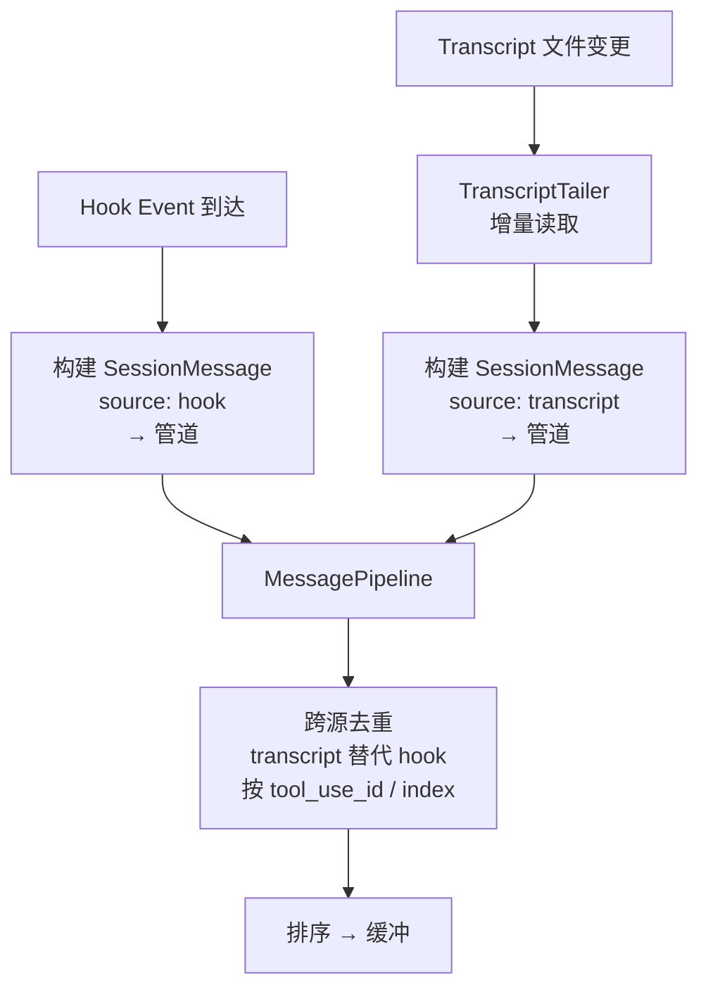

**关键规则**：
- Hook 和 Transcript **双路径都推送**到管道，不做生产者侧过滤
- `TRANSCRIPT_REPLACEABLE_EVENTS` 集合定义可能重复的事件：`PreToolUse`、`PostToolUse`、`PostToolUseFailure`、`UserPromptSubmit`、`TaskCreated`、`TaskCompleted`
- 管道去重：同一 `tool_use_id` / index 的 transcript entry **替代** hook event（跨源覆盖）
- **Hook 事件是安全网**：transcript tailer 延迟或异常时，hook 事件确保客户端至少收到基本信息
- 唯一例外：交互式 `PreToolUse`（AskUserQuestion / ExitPlanMode）的 hook event **不被替代**，以支持 takeover 阻塞

---

## 问题分析

当前 transcript 消息提取采用**按需轮询**方式：hook 事件到达后，TranscriptBridge 通过重试机制（0ms / 50ms / 150ms / 300ms）读取 transcript 文件，所有重试耗尽后回退到广播原始 hook event，并在后台每 2 秒轮询最多 30 秒。

### 问题 1：消息推送延迟严重

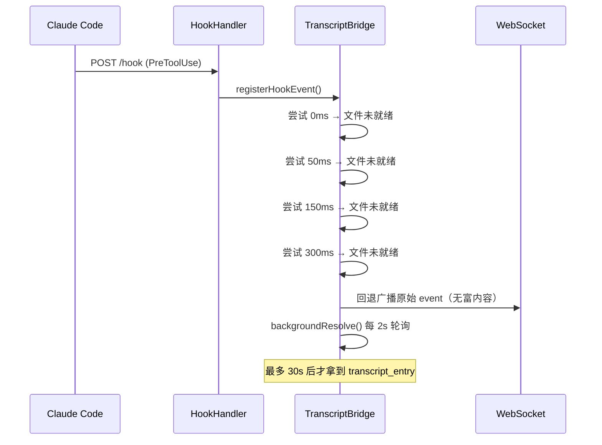

- 重试延迟靠猜测，数据可能在 400ms 才落盘但我们只查到 300ms
- 回退后的后台轮询间隔长达 2 秒，客户端需要等待最多 2 秒才能收到富内容

### 问题 2：Assistant 回复消息在 App MessageFlow 中不可见

TranscriptBridge 仅处理 `TRANSCRIPT_REPLACEABLE_EVENTS` 中的事件：

```typescript
static readonly TRANSCRIPT_REPLACEABLE_EVENTS = new Set([
  'PreToolUse', 'PostToolUse', 'PostToolUseFailure',
  'UserPromptSubmit', 'TaskCreated', 'TaskCompleted',
]);
```

且 `_shouldRouteToTranscriptBridge()` 要求 `!!toolUseId` 为 true。但：

- **Assistant 纯文本回复**（无 tool call）→ 没有对应的 hook 事件 → 永远不会触发 transcript 读取
- **UserPromptSubmit** → 没有 `tool_use_id` → 永远不会路由到 bridge
- Transcript 文件中有完整数据，但没有任何机制读取和广播这类消息

### 问题 3：架构耦合，无背压保护

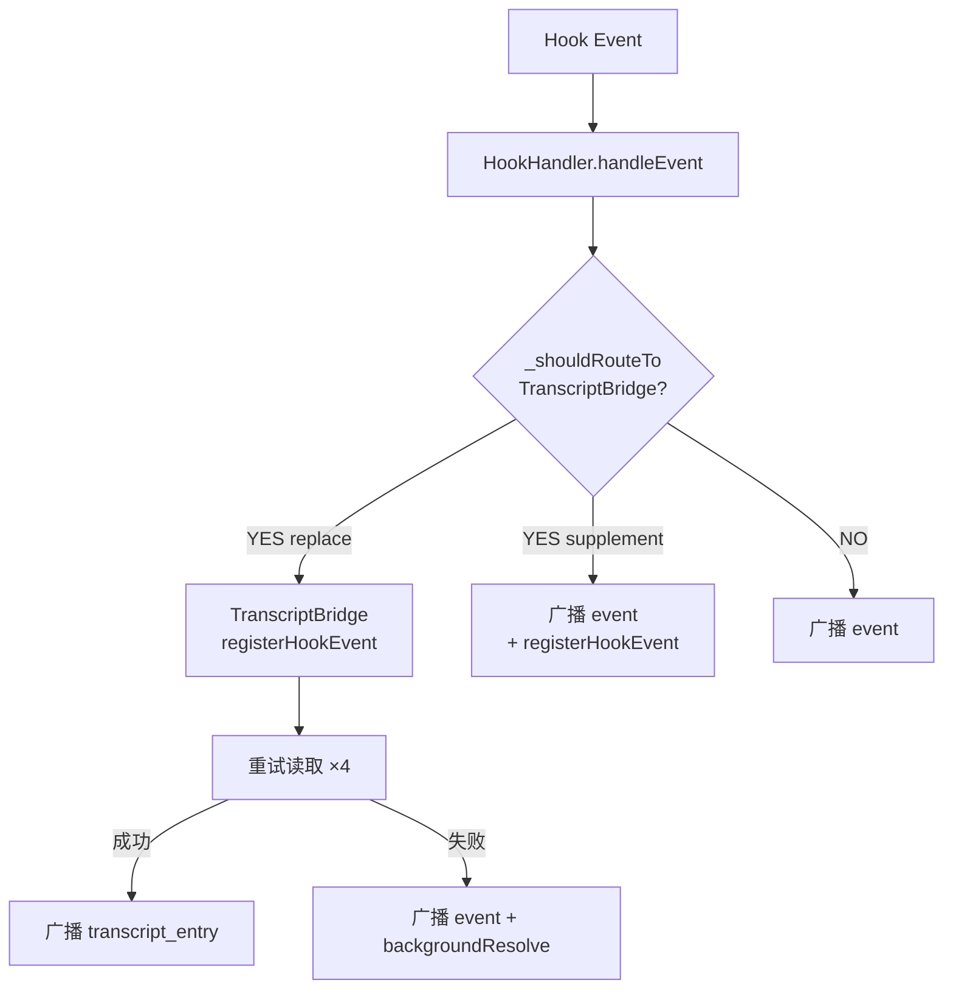

- 三路路由逻辑（替换 / 补充 / 直接广播）复杂且难以维护
- 无背压机制：当 WebSocket 消费端变慢（客户端断连、网络抖动），消息在内存中无限堆积 → OOM
- 广播与日志记录耦合在同一调用路径中，无法独立调节速率

---

## 新架构：背压流式管道

### 整体数据流

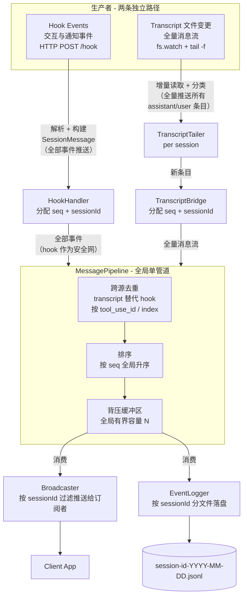

### 管道生命周期 vs 订阅生命周期

**管道是全局单例**，随 Gateway 启动创建、关闭时销毁。**实时推送与 WebSocket 连接绑定**：客户端连上 WebSocket 即自动接收所有 session 的实时消息，无需显式订阅。

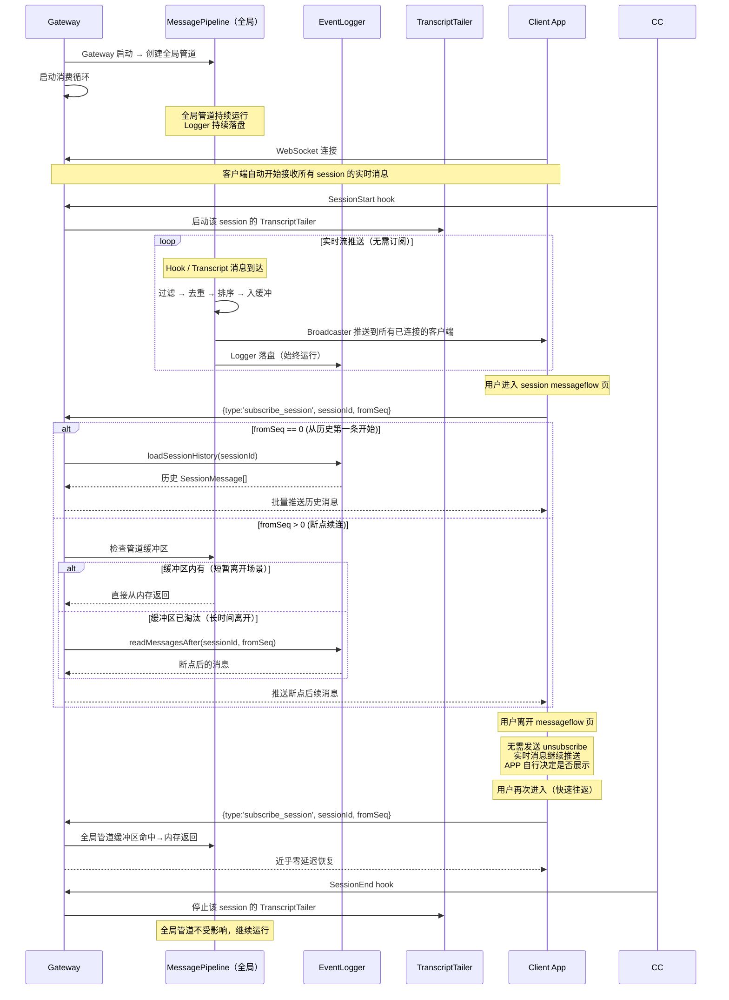

**关键设计决策**：

- **管道是全局单例**：Gateway 启动时创建，关闭时销毁。不随 session 创建/销毁。
- **全局固定内存预算**：无论多少 session 并发，管道容量固定（默认 500），内存占用可预测。
- **WebSocket 连接 = 自动接收所有实时消息**：客户端无需知道 session ID，连上即收。收到交互事件可第一时间决策。
- **subscribe_session 仅用于历史回溯**：客户端进入某个 session 的 messageflow 页面时，用 `fromSeq` 获取错过的历史消息。实时消息早已在推送。
- **无需 unsubscribe_session**：实时推送不依赖订阅状态，客户端离开页面只需停止 UI 展示，消息流不受影响。
- **SessionStart/SessionEnd 只管理 tailer**：创建/销毁 TranscriptTailer，不影响管道。
- **Logger 是唯一强制消费者**：无论是否有客户端在线，消息都会落盘，保证断连期间零丢失。
- **快速往返走内存热路径**：管道缓冲区命中，零磁盘 IO。
- **长时间离开回退磁盘**：管道缓冲区被淘汰后，从 EventLogger 磁盘恢复。

### 生产者-消费者速率模型

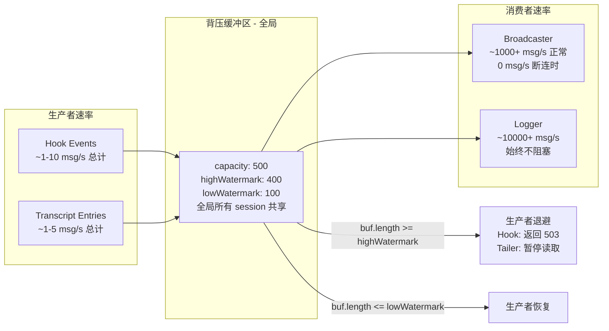

---

## 协议扩展

### 新增 ClientMessage 类型

```typescript
// src/shared/protocol.ts — ClientMessage 联合体新增

export type ClientMessage =
  // ... 现有类型保持不变 ...
  | { type: 'subscribe_session'; sessionId: string; fromSeq: number };
```

| 字段 | 说明 |
|------|------|
| `sessionId` | 目标 session ID |
| `fromSeq` | 断点续连序号。`0` = 从历史第一条开始（读日志）；`> 0` = 从该 seq 之后开始推送 |

> **注意**：`subscribe_session` 仅用于历史回溯。实时消息在 WebSocket 连接建立后自动推送全部 session，无需订阅。

### 新增 SessionMessage 统一结构

```typescript
// src/shared/protocol.ts — 管道内统一消息结构

export interface SessionMessage {
  sessionId: string;
  seq: number;
  timestamp: number;
  source: 'hook' | 'transcript';
  /** 当 source === 'hook' 时存在 */
  event?: SSEHookEvent;
  /** 当 source === 'transcript' 时存在 */
  entry?: TranscriptEntry;
}
```

### PROTOCOL_VERSION

`PROTOCOL_VERSION` 不变（`subscribe_session` 为新增可选消息类型，旧客户端不发送则不影响）。`unsubscribe_session` 不再需要，客户端断连由 WebSocket close 事件自然表示。

---

## 模块设计

### 1. MessagePipeline（新模块）

**文件**: `src/backend/gateway/message-pipeline.ts`

**全局单例**，Gateway 启动时创建、关闭时销毁。所有 session 共享同一个管道。负责接收两条生产者路径的消息，经过去重排序后缓冲，供两个消费者（广播、日志）拉取。

#### 管道内部流程

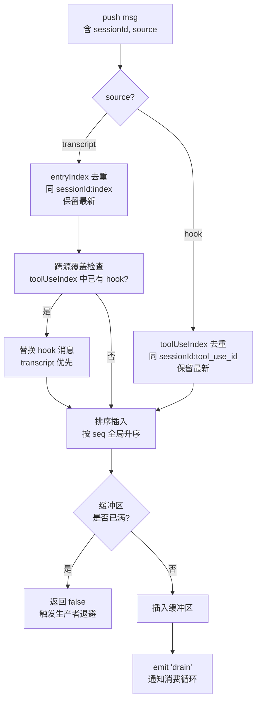

#### API

```typescript
export interface SessionMessage {
  sessionId: string;
  seq: number;
  timestamp: number;
  source: 'hook' | 'transcript';
  event?: SSEHookEvent;
  entry?: TranscriptEntry;
}

export class MessagePipeline {
  constructor(options?: {
    capacity?: number;        // 默认 500
    highWatermark?: number;   // 默认 400 (0.8 * capacity)
    lowWatermark?: number;    // 默认 100 (0.2 * capacity)
  });

  /** 生产者接口：推入一条消息。返回 false 表示缓冲区满，生产者应退避。 */
  push(msg: SessionMessage): boolean;

  /** 消费者接口：拉取一批消息（最多 maxCount 条）。返回空数组表示暂无数据。 */
  pull(maxCount: number): SessionMessage[];

  /** 消费者接口：拉取指定 session 的消息（用于订阅者分发） */
  pullForSession(sessionId: string, maxCount: number): SessionMessage[];

  /** 获取缓冲区中指定 session 从 fromSeq 之后的消息（热路径） */
  getBufferedForSession(sessionId: string, fromSeq: number): SessionMessage[];

  /** 当前缓冲区消息数 */
  get size(): number;

  /** 缓冲区是否已满（>= highWatermark） */
  isBackpressured(): boolean;

  /** 缓冲区是否为空 */
  isEmpty(): boolean;

  /** 销毁管道，释放资源 */
  destroy(): void;
}
```

#### 背压机制

| 水位线 | 触发条件 | 行为 |
|--------|----------|------|
| `highWatermark` | `buffer.length >= 400` | `push()` 返回 `false`，生产者进入退避 |
| `lowWatermark` | `buffer.length <= 100` | 生产者从退避中恢复，`push()` 重新接受 |
| `capacity` | `buffer.length >= 500` | 硬上限，超过此值拒绝（不应到达，highWatermark 提前拦截） |

#### 去重策略

管道内维护两个索引用于去重：

| 索引 | 键 | 用途 |
|------|-----|------|
| `toolUseIndex` | `sessionId:tool_use_id` | hook ↔ transcript 跨源去重 |
| `entryIndex` | `sessionId:index` | transcript 自身去重（重读、截断恢复） |

**跨源去重规则**：

| 场景 | 管道中已有 | 新到消息 | 处理 |
|------|-----------|---------|------|
| Tailer 正常 | — | transcript entry | 直接插入 |
| Tailer 正常 | — | hook event（同 tool_use_id） | 直接插入 |
| Hook 先到 | hook event | transcript entry（同 tool_use_id） | **transcript 替换 hook**（覆盖写入原缓冲区位置） |
| Tailer 延迟 | hook event | — | hook 作为安全网保留，等 transcript 到达后替换 |
| 交互式 PreToolUse | hook event | transcript entry | **不替换**，保留 hook（takeover 需要） |
| Tailer 重读 | transcript entry（旧 index） | transcript entry（同 index） | 保留最新 |

---

### 2. SessionStreamManager（新模块）

**文件**: `src/backend/gateway/session-stream-manager.ts`

持有全局 MessagePipeline，管理 TranscriptTailer 生命周期，处理客户端历史回放请求。**不承担消费调度**——消费逻辑在 server.ts 中实现，与 WebSocket 基础设施就近配合。

#### 职责

- 创建/持有全局 `MessagePipeline`（Gateway 生命周期内唯一实例）
- 管理所有 TranscriptTailer 生命周期（由 SessionStart/SessionEnd 触发）
- 处理历史回放：优先命中管道内存缓冲区（热路径），淘汰后才回退 EventLogger 磁盘
- 暴露 `push()` 给生产者，暴露 `pull()` 和缓冲查询给消费者

#### 架构位置

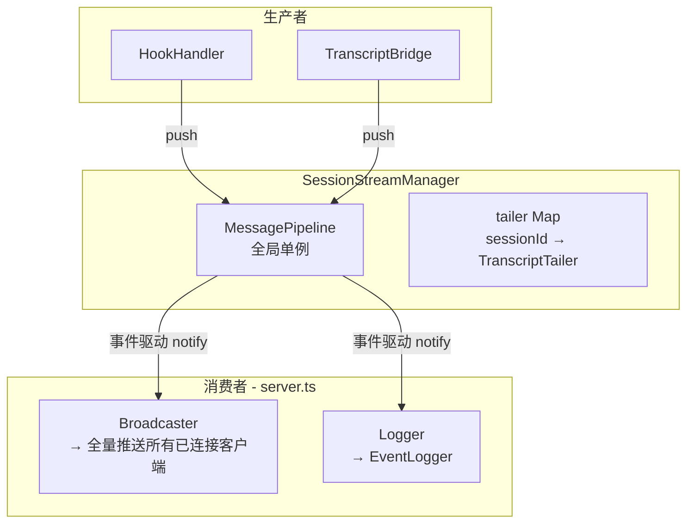

#### API

```typescript
export class SessionStreamManager {
  constructor(
    eventLogger: EventLogger,
    wsBus: WsBus,
    options?: {
      pipelineCapacity?: number;      // 默认 500
      pipelineHighWatermark?: number; // 默认 400
      pipelineLowWatermark?: number;  // 默认 100
    },
  );

  /** SessionStart 时启动 transcript tailer */
  startSession(sessionId: string, transcriptPath: string): void;

  /** SessionEnd 时停止 transcript tailer */
  stopSession(sessionId: string): void;

  /** 生产者推送消息到全局管道 */
  push(msg: SessionMessage): boolean;

  /** 消费者拉取批量消息（供消费循环调用） */
  pull(maxCount: number): SessionMessage[];

  /** 获取管道中指定 session 的缓冲消息（内存热路径） */
  getBufferedMessages(sessionId: string, fromSeq: number): SessionMessage[];

  /** 客户端请求历史回溯 */
  replayHistory(sessionId: string, fromSeq: number, targetDeviceId: string): Promise<void>;

  /** 管道背压状态 */
  isBackpressured(): boolean;

  /** Gateway 关闭：停止所有 tailer + 销毁管道 */
  shutdown(): void;
}
```

#### 消费循环（server.ts 中实现）

消费逻辑从 SessionStreamManager 移到 server.ts，通过 `pipeline.onDrain` 事件驱动：

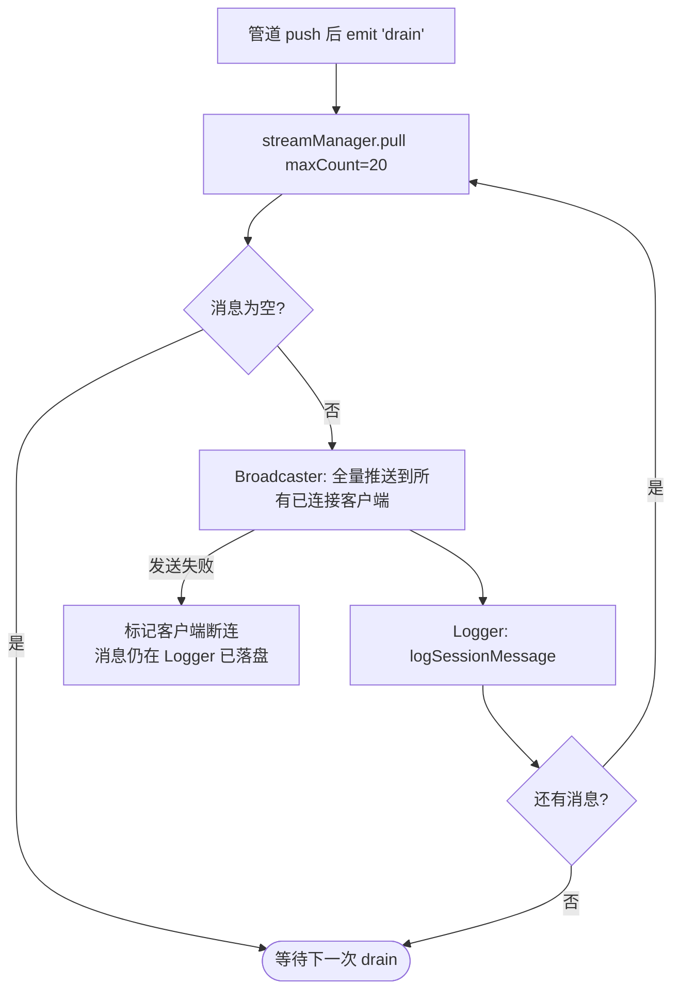

> 相比 50ms 定时轮询，事件驱动在空闲时零 CPU 消耗。`drain` 事件在 `push()` 成功时触发，消费循环批量排空管道后等待下一次 drain。

---

### 3. TranscriptTailer（新模块）

**文件**: `src/backend/gateway/transcript-tailer.ts`

持续监控单个 Claude Code transcript JSONL 文件，增量读取并分类新条目。新条目推入 MessagePipeline。

#### 启动追赶阶段

Tailer 启动时先执行**追赶阶段**（catch-up），确保不遗漏启动前已有条目：

1. `stat` 检查文件是否存在 → 若不存在，退避重试（200/400/800/1600/3200ms，共约 6.2s）
2. 文件存在后，从 offset 0 全量读取已有条目
3. 逐条 `classifyEntry` → 构建 `SessionMessage` → `push` 到管道
4. 管道去重保证：即使部分条目已由 hook 事件推送过，transcript 版本会自然替代
5. 追赶完成后，记录 `lastKnownSize`，进入增量监控阶段

> 追赶阶段消除了 SessionStart → 首个 tool_use 之间的竞态窗口：即使 tailer 启动略晚于首条消息，追赶阶段会补齐遗漏条目。

#### 文件监控策略

| 层级 | 机制 | 说明 |
|------|------|------|
| **主** | `fs.watch(parentDir, { persistent: false })` | 监听父目录而非文件本身，兼容 CC 的 atomic rename（写临时文件后 rename） |
| **备** | `setInterval(poll, 1000ms)` | 网络文件系统（Docker 挂载卷、NFS/SMB）上 FSEvents 不可靠时的兜底 |

> **Docker/NFS 注意事项**：容器环境或网络文件系统中 `fs.watch` 可能不触发。poll 兜底保证 1s 内感知变更。若 1s 延迟仍不可接受，可调整 poll 间隔。

#### 与管道的交互

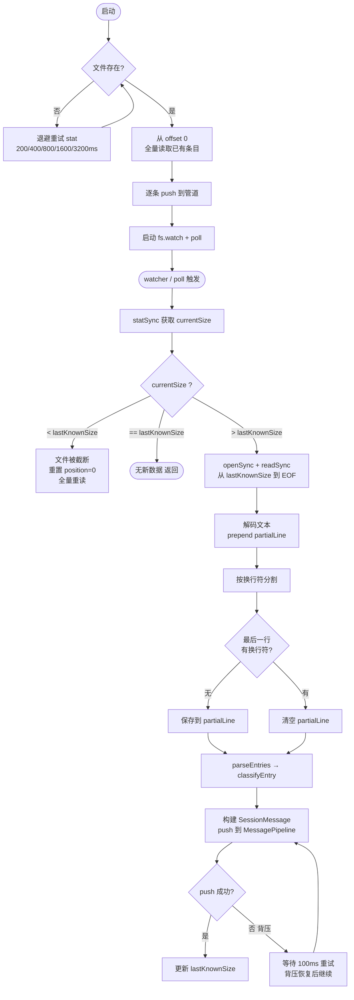

#### 截断与异常处理

| 场景 | 处理方式 |
|------|----------|
| 文件不存在（启动时） | 退避重试 statSync（200/400/800/1600/3200ms），共约 6.2s 超时 |
| 文件被删除（运行中） | fs.watch 发出 `rename` → emit error + 停止 tailing |
| 文件被截断 | `stat.size < lastKnownSize` → 重置 position=0, lineIndex=0，全量重读并自然去重 |
| 不完整写入（行未写完） | partialLine 缓冲区保存不完整行，下次读取时 prepend 拼接 |
| 并发 watcher + poll 触发 | `_reading` 布尔锁跳过重叠读取 |
| 管道背压 | `push()` 返回 false 时暂停读取，100ms 后重试 |

---

### 4. TranscriptBridge（重构）

**文件**: `src/backend/gateway/transcript-bridge.ts`

从"按需读取协调器"变为"tailer 生命周期管理器"。tailer 发现新条目后推入 MessagePipeline，而非直接广播。

#### 移除

- `registerHookEvent()` — 不再由 hook 事件触发读取
- `fetchAndBroadcast()` — 整个重试循环
- `backgroundResolve()` — 30 秒回退轮询
- `pending` Map、`TRANSCRIPT_RETRY_DELAYS_MS` 等

#### 新增

```typescript
private tailers = new Map<string, TranscriptTailer>();
private streamManager: SessionStreamManager;

startSession(sessionId: string, transcriptPath: string): void {
  // 创建 TranscriptTailer，onEntry 回调中构建 SessionMessage 并 push 到 streamManager
}

stopSession(sessionId: string): void {
  // 停止 tailer 并从 Map 中移除
}
```

#### 保留

- `getRecentTranscriptEntries()` — 用于客户端连接恢复（非 stream 路径）

---

### 5. HookHandler（简化）

**文件**: `src/backend/gateway/hook-handler.ts`

移除 transcript 路由逻辑，所有 hook event 统一包装为 `SessionMessage` 推入管道。去重由管道的跨源覆盖逻辑处理，不在生产者侧做过滤决策。

#### 移除

- `_shouldRouteToTranscriptBridge()` 方法
- 三路路由分支（replace / supplement / direct）
- `TRANSCRIPT_REPLACEABLE_EVENTS` 事件分类过滤逻辑

#### 统一推送流程

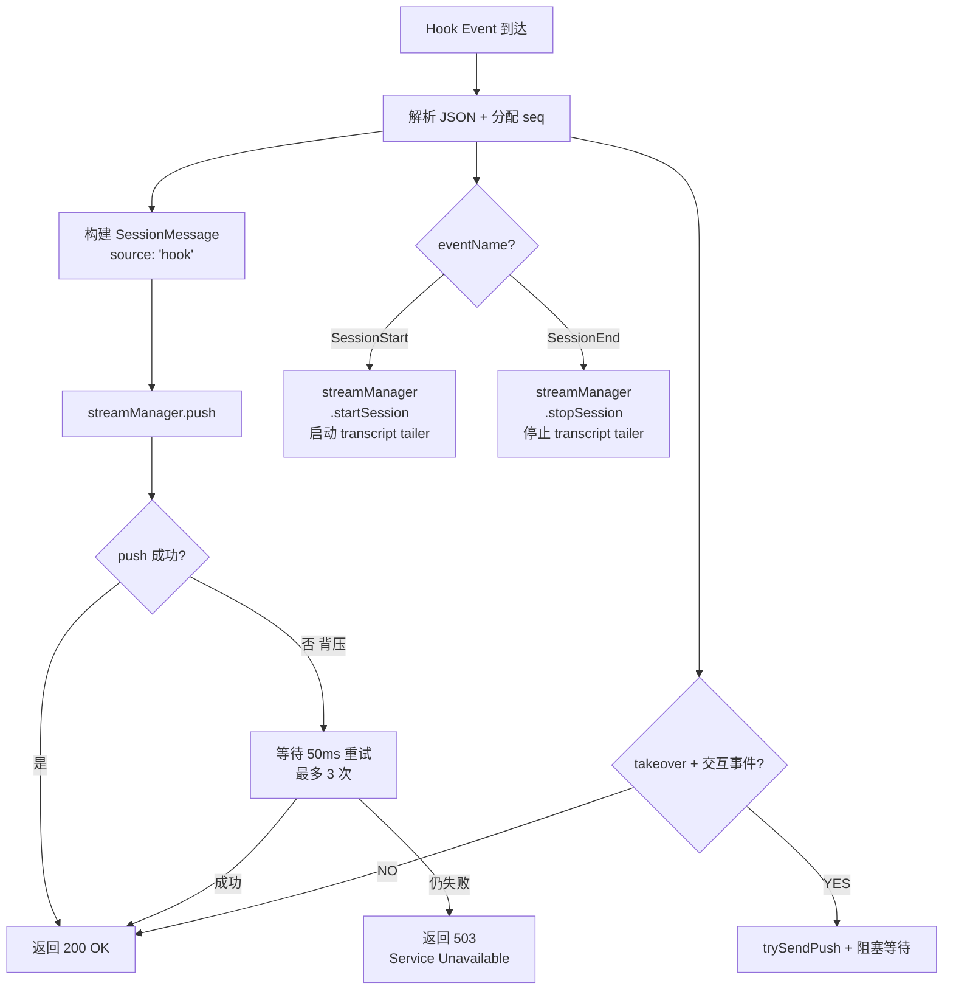

> **关键简化**：所有 hook 事件（包括 `TRANSCRIPT_REPLACEABLE_EVENTS` 中的）统一推入管道。管道层通过跨源去重（transcript 替代 hook）消除重复。这样 HookHandler 不需要判断"这个事件是否会被 transcript 覆盖"——它只负责生产，去重是消费者的职责。

---

## 历史回放与断点续连

### 流程

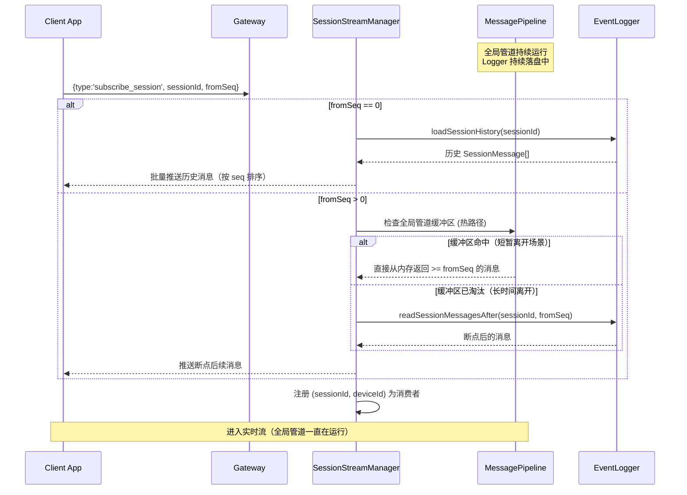

### EventLogger 扩展

新增 SessionMessage 粒度的日志方法：

```typescript
// EventLogger 新增
logSessionMessage(msg: SessionMessage): void {
  // 写入 {logDir}/session-{sessionId}-{YYYY-MM-DD}.jsonl
  // 格式: { _timestamp, _seq, ...msg }
}

loadSessionHistory(sessionId: string, maxCount?: number): SessionMessage[] {
  // 按日期扫描 session-{sessionId}-*.jsonl
  // 返回按 seq 排序的历史消息
}

readSessionMessagesAfter(sessionId: string, afterSeq: number, maxCount?: number): SessionMessage[] {
  // 加载 afterSeq 之后的消息，用于断点续连
}
```

---

## 问题解决对照

| 问题 | 根因 | 解决方案 |
|------|------|----------|
| 推送延迟严重 | 按需轮询有重试延迟（最多 500ms+）+ 回退轮询（2s 间隔） | fs.watch 持续监控，消息进入管道后 ~100ms 内推送 |
| Assistant 消息不可见 | 纯文本回复无 hook 事件，永远不会触发 transcript 读取 | tailer 持续监控文件，捕获所有 assistant/user 条目进入管道 |
| 架构无背压 | 广播与日志耦合，消费端变慢时内存无限堆积 | MessagePipeline 有界缓冲 + highWatermark 反压生产者 |
| 断连消息丢失 | 客户端断连后消息仍在广播但无持久化机制恢复 | Logger 持续落盘，客户端重连通过 subscribe_session + fromSeq 恢复 |
| 消息乱序 | Hook 流和 Transcript 流独立推送 | 管道内按 seq 排序后统一输出 |
| 消息重复 | 同一 tool_use_id 的 hook event 和 transcript entry 双重推送 | 管道跨源去重：transcript 替代 hook（tool_use_id / index 索引） |
| Tailer 异常导致消息丢失 | fs.watch 漏事件、Docker 环境、atomic rename 等 | Hook 事件作为安全网保留在管道中，tailer 恢复后 transcript 替代 hook；启动追赶阶段补齐遗漏条目 |

---

## 文件变更清单

| 文件 | 操作 | 说明 |
|------|------|------|
| `src/shared/protocol.ts` | 修改 | 新增 `SessionMessage` 接口；`ClientMessage` 联合体新增 `subscribe_session` |
| `src/backend/gateway/message-pipeline.ts` | **新建** | 有界消息管道：过滤 → 去重 → 排序 → 背压缓冲 |
| `src/backend/gateway/session-stream-manager.ts` | **新建** | 全局管道持有 + tailer 生命周期 + 历史回放协调 |
| `src/backend/gateway/transcript-reader.ts` | 修改 | 导出 classifyEntry、parseTimestamp、parseEntries |
| `src/backend/gateway/transcript-tailer.ts` | **新建** | 持续文件监控引擎，推入管道 |
| `src/backend/gateway/transcript-bridge.ts` | 重构 | tailer 生命周期管理，推入管道 |
| `src/backend/gateway/hook-handler.ts` | 简化 | 移除 transcript 路由，所有事件推入管道 |
| `src/backend/gateway/event-logger.ts` | 修改 | 新增 SessionMessage 粒度的日志读写方法 |
| `src/backend/gateway/server.ts` | 修改 | 创建 SessionStreamManager，运行事件驱动消费循环，处理 subscribe_session（历史回溯） |
| `src/backend/gateway/message-pipeline.test.ts` | **新建** | 管道单元测试（背压、去重、排序） |
| `src/backend/gateway/session-stream-manager.test.ts` | **新建** | 流管理集成测试 |
| `src/backend/gateway/transcript-tailer.test.ts` | **新建** | tailer 单元测试 |
| `src/backend/gateway/transcript-bridge.test.ts` | 更新 | 移除重试测试，新增生命周期测试 |
| `src/backend/gateway/hook-handler.test.ts` | 更新 | 移除路由测试，新增管道推送 + 背压测试 |

---

## 验证方案

1. **单元测试**: `npm test` 运行全部 vitest 测试
   - MessagePipeline 背压水位线测试
   - MessagePipeline 去重排序正确性
   - SessionStreamManager 消费循环正确性
   - HookHandler 背压下 503 返回
2. **类型检查**: `npm run typecheck`
3. **端到端验证**:
   - 启动 `npm run dev`，连接真实 Claude Code session
   - 客户端 WebSocket 连接后验证自动收到所有 session 的实时消息
   - 发送 assistant 纯文本消息 → 验证 app messageflow 中可见
   - 客户端发送 `subscribe_session` + `fromSeq` → 验证历史回溯 + 断点续连
   - 客户端快速往返（切换 tab 再回来）→ 验证 `subscribe_session` 走内存缓冲区热路径
   - 模拟客户端断连 → 验证背压触发 + 503
   - 客户端重连后验证实时消息自动恢复推送
   - 验证 WebSocket 断连期间 Logger 持续落盘，消息零丢失
   - 验证 SessionEnd 后 tailer 正确停止，全局管道不受影响
4. **安全网 / 降级验证**:
   - 模拟 transcript 文件写入延迟（tailer 未读到）→ 验证 hook 事件作为安全网正常推送
   - 模拟 transcript 文件后续写入完成 → 验证 transcript_entry 替代管道中的 hook 事件
   - 模拟 Docker/NFS 环境（仅 poll 兜底）→ 验证 1s 内感知文件变更
   - 验证交互式 PreToolUse（AskUserQuestion）hook 不被 transcript 替代
5. **多 session 并发**: 验证多个 session 同时运行时全局管道正常处理 + 内存无泄漏（固定容量）
