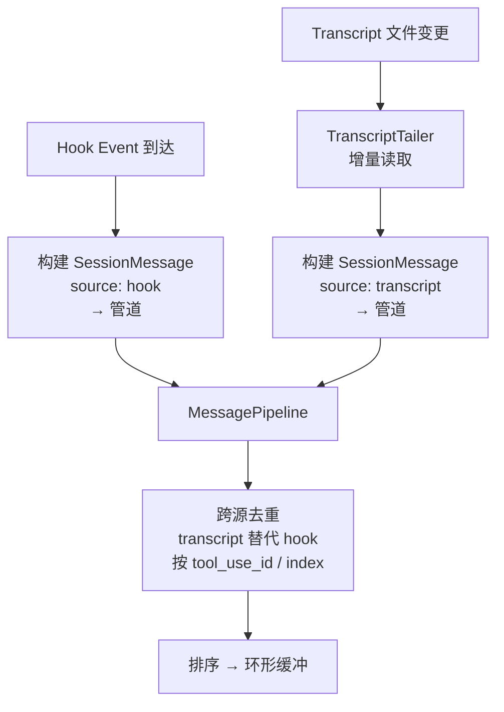
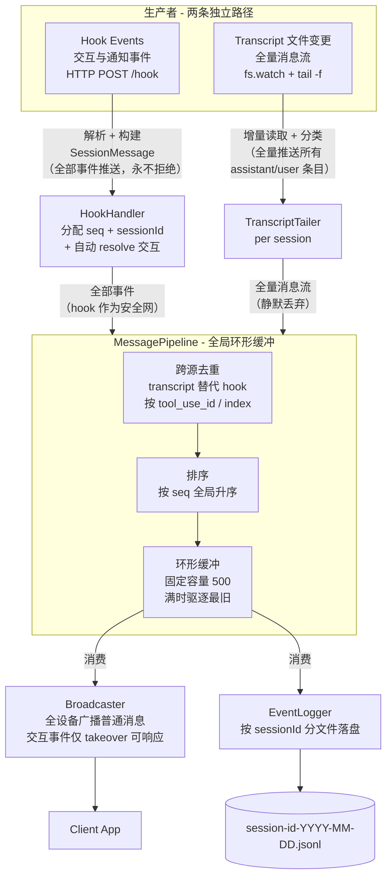
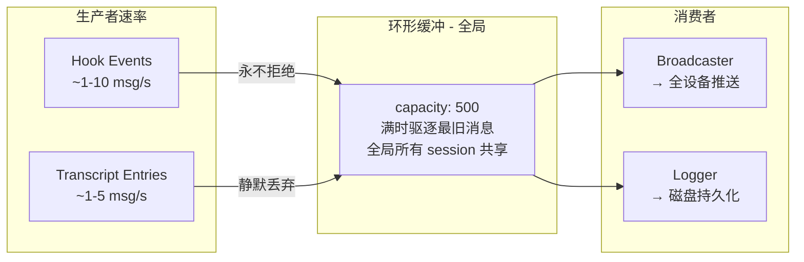
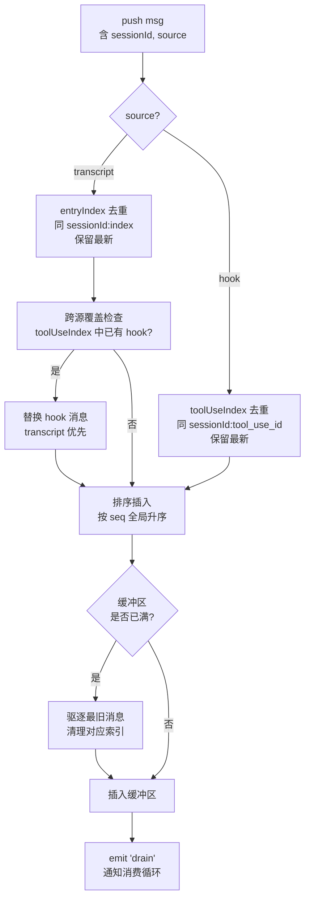
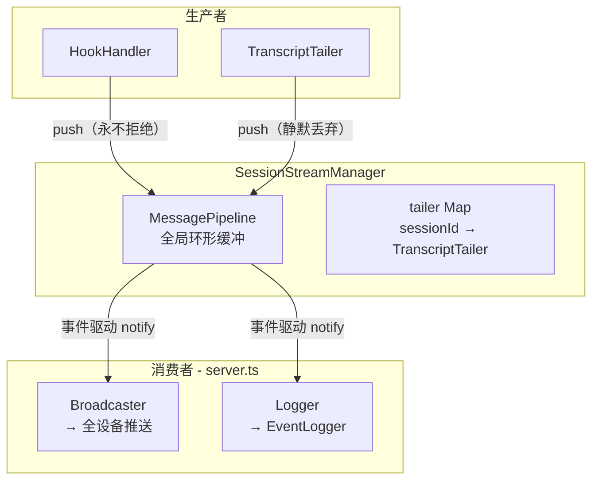
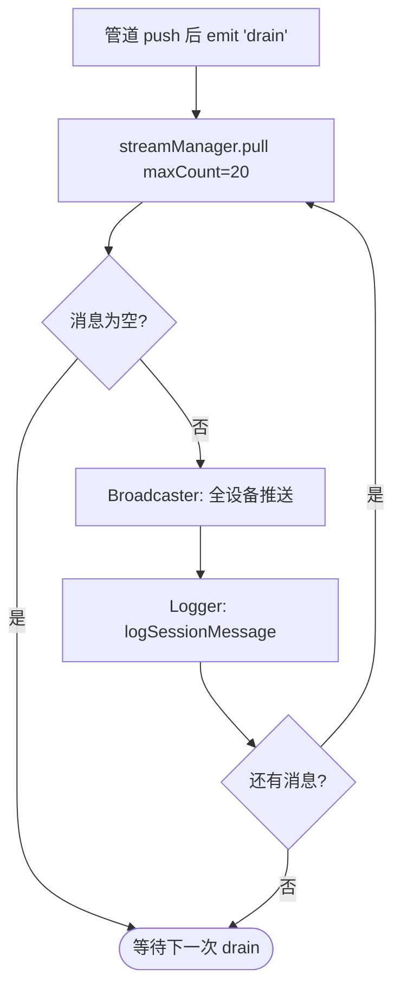
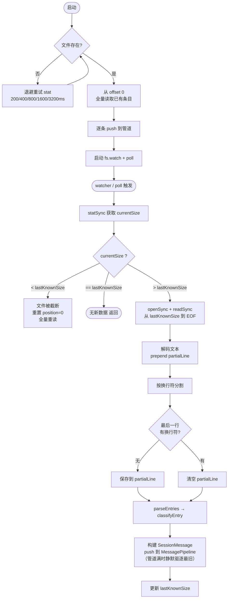
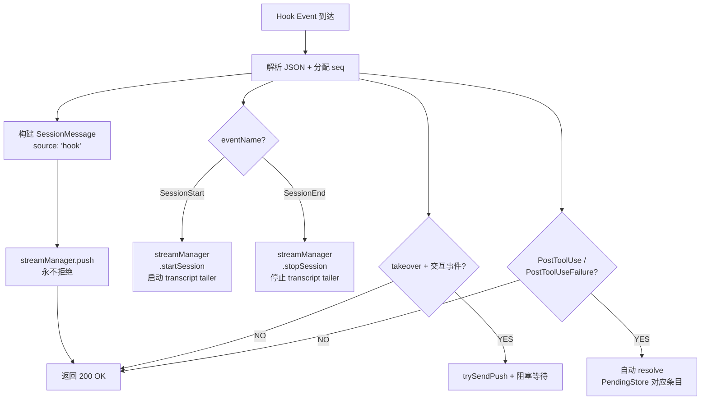
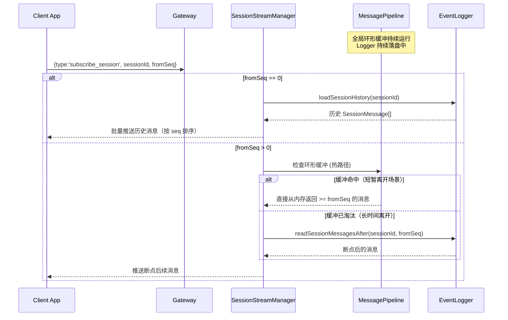

# Session MessageFlow 流式消息架构

## 名词定义

| 名词 | 定义 |
|------|------|
| **SessionMessage** | 统一的 session 消息结构，包装 hook event 或 transcript entry，带 seq + timestamp |
| **MessagePipeline** | 全局固定容量环形缓冲（单例），所有 session 共享，负责去重 → 排序 → 缓冲 |
| **断点续连** | 客户端重连时携带 `fromSeq`，服务端从该序号开始推送，0 表示从日志第一条开始 |
| **subscribe_session** | 客户端进入 session messageflow 页面时发送，用于历史回溯（断点续连）。实时消息在 WebSocket 连接建立后自动推送，无需订阅 |
| **交互释放** | 阻塞交互事件（PermissionRequest/Stop/AskUserQuestion/ExitPlanMode）得到响应或被取消后，gateway 标记其为已释放，防止客户端重复响应 |

---

## 消息广播规则

### 普通消息 → 全设备广播

所有非交互类消息（transcript entry、通知事件、生命周期事件等）推送给所有已连接的设备，无论通过哪个 link 连接。

### 交互事件 → 仅 takeover 设备可响应

阻塞交互事件（PermissionRequest、Stop、AskUserQuestion、ExitPlanMode）的推送分为两层：

| 层级 | 接收者 | 行为 |
|------|--------|------|
| 事件通知 | 所有设备 | 在 MessageFlow 中显示事件内容（只读） |
| 交互 chip | 仅 takeover 设备 | 显示可操作的 chip，允许用户响应 |

非 takeover 设备为**只读模式**：可以看到交互事件的消息内容，但不显示交互 chip，无法响应。

### 交互释放状态

Gateway 维护每个交互事件的释放状态。交互释放的触发路径：

| 释放路径 | 机制 |
|----------|------|
| 手机 App 通过 chip 响应 | `ClientInteract` → `PendingStore.resolve()` |
| CLI 终端直接响应 | `PostToolUse` hook 到达 → `HookHandler` 自动 resolve 对应 PendingStore 条目 |
| Session 结束 | `SessionEnd` → `PendingStore.releaseSession()` |
| Takeover 切换 | `setMode('bystander')` → `PendingStore.releaseAll()` |

**设计要点**：
- `PendingStore` 中未释放的交互才会出现在 `GatewayConnected.pendingInteractions` 中
- 客户端重连时只收到真正未释放的交互，不会重复显示已响应的 chip
- 服务端重启后 `PendingStore` 为空，但历史消息通过 `subscribe_session` 完整加载（含 PostToolUse 匹配 PreToolUse），客户端 EventManager 自动更新状态

---

## Hook 与 Transcript 职责划分

系统中有两条独立的消息生产者路径，职责明确分离，保证推送给客户端的消息不重复。

### Transcript — 全量消息流（主生产者）

Transcript 负责推送 CC 的**完整行为过程**，供用户在 App MessageFlow 中阅读 CC 正在做什么。

**推送内容**：
- 所有 `assistant` 条目 → thinking、text、tool_use blocks
- 所有 `user` 条目 → text、tool_result blocks
- 附带 model、usage（token 消耗）等富信息

**读取方式**：TranscriptTailer 通过 `fs.watch` 持续监控 transcript JSONL 文件，增量读取新条目并推入管道。

### Hook — 交互与通知事件（辅生产者）

Hook 负责推送 transcript 中**不存在的系统事件和交互事件**，告知用户状态变更，并在 takeover 模式下阻塞等待用户决策。

**推送内容**：transcript 无法覆盖的系统生命周期事件、权限请求、用户交互等。

### HookEvent 分类：哪些与 Transcript 重复

以下表格完整列出全部 26 个 HookEvent 类型，分析其与 transcript 的覆盖关系：

#### 与 Transcript 重复 → 双路径推送，管道去重

这些事件对应的内容在 transcript 中以更丰富的格式存在。系统采用**双路径推送 + 管道去重**策略：hook 事件和 transcript entry 都进入管道，管道的跨源去重逻辑保证同一 `tool_use_id` 只保留一条消息（transcript 优先）。

| Hook Event | Transcript 中的对应内容 | 去重策略 |
|---|---|---|
| `PreToolUse`（非交互） | assistant entry → tool_use block | Transcript 包含完整 thinking + text + tool_use，替代 hook 元数据 |
| `PostToolUse` | user entry → tool_result block | Transcript 包含完整 tool_result 内容 |
| `PostToolUseFailure` | user entry → tool_result block（`isError: true`） | Transcript 包含完整错误信息 |
| `UserPromptSubmit` | user entry → text block | Transcript 包含完整用户输入文本 |
| `TaskCreated` | transcript 中对应 task 条目 | Transcript 包含完整 task 信息 |
| `TaskCompleted` | transcript 中对应 task 条目 | Transcript 包含完整 task 结果 |

> **设计意图**：hook 事件作为**安全网**保留在管道中。正常情况下 transcript 的富内容会替代它；当 transcript tailer 延迟或异常时，hook 事件确保客户端至少收到基本信息，不会出现消息永久丢失。

> **例外**：交互式 `PreToolUse`（工具名为 `AskUserQuestion` 或 `ExitPlanMode`）hook 事件**不被替代**，因为 takeover 模式需要它来阻塞 HTTP 响应等待用户决策。

#### Transcript 无覆盖 → 推送给客户端

这些事件属于系统生命周期、权限交互、配置变更等，transcript 中完全没有对应内容，**必须由 hook 推送**。

| 类别 | Hook Events | 说明 |
|---|---|---|
| **Session 生命周期** | `SessionStart`、`SessionEnd` | Session 启停，trigger tailer 创建/销毁 |
| **权限与决策** | `PermissionRequest`、`PermissionDenied` | 用户权限审批流程 |
| **停止交互** | `Stop`、`SubagentStop`、`StopFailure` | CC 询问是否继续、停止失败通知 |
| **引导交互** | `Elicitation`、`ElicitationResult` | CC 向用户提问及结果 |
| **通用通知** | `Notification` | 系统状态通知 |
| **指令与配置** | `InstructionsLoaded`、`ConfigChange` | CLAUDE.md 加载、配置变更 |
| **Subagent 生命周期** | `SubagentStart`、`TeammateIdle` | 子 agent 启动、空闲 |
| **会话压缩** | `PreCompact`、`PostCompact` | 上下文压缩前后通知 |
| **文件与目录** | `CwdChanged`、`FileChanged` | 工作目录变更、文件变更 |
| **Worktree** | `WorktreeCreate`、`WorktreeRemove` | 工作树创建、移除 |

### 数据流中的去重位置



**关键规则**：
- Hook 和 Transcript **双路径都推送**到管道，不做生产者侧过滤
- `TRANSCRIPT_REPLACEABLE_EVENTS` 集合定义可能重复的事件：`PreToolUse`、`PostToolUse`、`PostToolUseFailure`、`UserPromptSubmit`、`TaskCreated`、`TaskCompleted`
- 管道去重：同一 `tool_use_id` / index 的 transcript entry **替代** hook event（跨源覆盖）
- **Hook 事件是安全网**：transcript tailer 延迟或异常时，hook 事件确保客户端至少收到基本信息
- 唯一例外：交互式 `PreToolUse`（AskUserQuestion / ExitPlanMode）的 hook event **不被替代**，以支持 takeover 阻塞

---

## 新架构：流式消息管道

### 整体数据流



### 管道生命周期 vs 订阅生命周期

**管道是全局单例**，随 Gateway 启动创建、关闭时销毁。**实时推送与 WebSocket 连接绑定**：客户端连上 WebSocket 即自动接收所有 session 的实时消息，无需显式订阅。


**关键设计决策**：

- **管道是全局单例**：Gateway 启动时创建，关闭时销毁。不随 session 创建/销毁。
- **全局固定内存预算**：无论多少 session 并发，管道容量固定（默认 500），内存占用可预测。
- **环形缓冲满时静默驱逐最旧**：不做背压。Hook 事件永不拒绝，Transcript 消息静默丢弃（Logger 已落盘）。
- **WebSocket 连接 = 自动接收所有实时消息**：客户端无需知道 session ID，连上即收。
- **subscribe_session 仅用于历史回溯**：客户端进入某个 session 的 messageflow 页面时，用 `fromSeq` 获取错过的历史消息。实时消息早已在推送。
- **无需 unsubscribe_session**：实时推送不依赖订阅状态，客户端离开页面只需停止 UI 展示。
- **SessionStart/SessionEnd 只管理 tailer**：创建/销毁 TranscriptTailer，不影响管道。
- **Logger 是唯一强制消费者**：无论是否有客户端在线，消息都会落盘，保证断连期间零丢失。
- **快速往返走内存热路径**：环形缓冲命中，零磁盘 IO。
- **长时间离开回退磁盘**：缓冲被淘汰后，从 EventLogger 磁盘恢复。

### 环形缓冲模型

管道采用固定容量环形缓冲，满时静默驱逐最旧消息。不做背压——Hook 事件是阻塞 CC 的关键路径，返回 503 会破坏会话正确性。

**设计理由**：

- 个人单用户工具，生产者速率约 15 msg/s，500 条缓冲 ≈ 33 秒窗口
- 手机断连通常几秒到几十秒，33 秒窗口覆盖绝大多数场景
- 即使消息被驱逐，Logger 已落盘，客户端重连后通过 `subscribe_session` 从磁盘恢复
- Hook 事件永不拒绝：`PermissionRequest`/`Stop` 被 503 的后果远严重于丢失几条 transcript 消息



---

## 模块设计

### 1. MessagePipeline

**文件**: `src/backend/gateway/message-pipeline.ts`

**全局单例**，Gateway 启动时创建、关闭时销毁。所有 session 共享同一个环形缓冲。负责接收两条生产者路径的消息，经过去重排序后缓冲，供两个消费者（广播、日志）拉取。

#### 管道内部流程



#### API

```typescript
export class MessagePipeline {
  constructor(options?: {
    capacity?: number;        // 默认 500
  });

  /** 生产者接口：推入一条消息。满时静默驱逐最旧，永不拒绝。 */
  push(msg: SessionMessage): void;

  /** 消费者接口：拉取一批消息（最多 maxCount 条）。返回空数组表示暂无数据。 */
  pull(maxCount: number): SessionMessage[];

  /** 获取缓冲区中指定 session 从 fromSeq 之后的消息（热路径） */
  getBufferedForSession(sessionId: string, fromSeq: number): SessionMessage[];

  /** 当前缓冲区消息数 */
  get size(): number;

  /** 缓冲区是否为空 */
  isEmpty(): boolean;

  /** 销毁管道，释放资源 */
  destroy(): void;
}
```

#### 环形缓冲驱逐策略

缓冲区满时驱逐最旧消息（FIFO）。驱逐时同步清理去重索引中对应条目。

| 条件 | 行为 |
|------|------|
| `buffer.length >= capacity` | 弹出 `buffer[0]`（最旧），清理其 toolUseIndex/entryIndex 条目 |
| `buffer.length < capacity` | 正常追加 |

#### 去重策略

管道内维护两个索引用于去重：

| 索引 | 键 | 用途 |
|------|-----|------|
| `toolUseIndex` | `sessionId:tool_use_id` | hook ↔ transcript 跨源去重 |
| `entryIndex` | `sessionId:index` | transcript 自身去重（重读、截断恢复） |

**跨源去重规则**：

| 场景 | 管道中已有 | 新到消息 | 处理 |
|------|-----------|---------|------|
| Tailer 正常 | — | transcript entry | 直接插入 |
| Tailer 正常 | — | hook event（同 tool_use_id） | 直接插入 |
| Hook 先到 | hook event | transcript entry（同 tool_use_id） | **transcript 替换 hook**（覆盖写入原缓冲区位置） |
| Tailer 延迟 | hook event | — | hook 作为安全网保留，等 transcript 到达后替换 |
| 交互式 PreToolUse | hook event | transcript entry | **不替换**，保留 hook（takeover 需要） |
| Tailer 重读 | transcript entry（旧 index） | transcript entry（同 index） | 保留最新 |

---

### 2. SessionStreamManager

**文件**: `src/backend/gateway/session-stream-manager.ts`

持有全局 MessagePipeline，管理 TranscriptTailer 生命周期，处理客户端历史回放请求。消费逻辑在 server.ts 中实现，与 WebSocket 基础设施就近配合。

#### 职责

- 创建/持有全局 `MessagePipeline`（Gateway 生命周期内唯一实例）
- 管理所有 TranscriptTailer 生命周期（由 SessionStart/SessionEnd 触发）
- 处理历史回放：优先命中管道内存缓冲区（热路径），淘汰后才回退 EventLogger 磁盘
- 暴露 `push()` 给生产者，暴露 `pull()` 和缓冲查询给消费者

#### 架构位置



#### API

```typescript
export class SessionStreamManager {
  constructor(
    eventLogger: EventLogger,
    wsBus: WsBus,
    options?: {
      pipelineCapacity?: number;
      isHidden?: (sessionId: string) => boolean;
    },
  );

  /** SessionStart 时启动 transcript tailer */
  startSession(sessionId: string, transcriptPath: string): void;

  /** SessionEnd 时停止 transcript tailer */
  stopSession(sessionId: string): void;

  /** 生产者推送消息到全局管道（永不拒绝） */
  push(msg: SessionMessage): void;

  /** 消费者拉取批量消息（供消费循环调用） */
  pull(maxCount: number): SessionMessage[];

  /** 获取管道中指定 session 的缓冲消息（内存热路径） */
  getBufferedMessages(sessionId: string, fromSeq: number): SessionMessage[];

  /** 客户端请求历史回溯 */
  replayHistory(sessionId: string, fromSeq: number, targetDeviceId: string): Promise<void>;

  /** Gateway 关闭：停止所有 tailer + 销毁管道 */
  shutdown(): void;
}
```

#### 消费循环（server.ts 中实现）

消费逻辑通过 `pipeline.onDrain` 事件驱动：



> 相比 50ms 定时轮询，事件驱动在空闲时零 CPU 消耗。`drain` 事件在 `push()` 成功时触发，消费循环批量排空管道后等待下一次 drain。

---

### 3. TranscriptTailer

**文件**: `src/backend/gateway/transcript-tailer.ts`

持续监控单个 Claude Code transcript JSONL 文件，增量读取并分类新条目。新条目推入 MessagePipeline。

#### 启动追赶阶段

Tailer 启动时先执行**追赶阶段**（catch-up），确保不遗漏启动前已有条目：

1. `stat` 检查文件是否存在 → 若不存在，退避重试（200/400/800/1600/3200ms，共约 6.2s）
2. 文件存在后，从 offset 0 全量读取已有条目
3. 逐条 `classifyEntry` → 构建 `SessionMessage` → `push` 到管道
4. 管道去重保证：即使部分条目已由 hook 事件推送过，transcript 版本会自然替代
5. 追赶完成后，记录 `lastKnownSize`，进入增量监控阶段

#### 文件监控策略

| 层级 | 机制 | 说明 |
|------|------|------|
| **主** | `fs.watch(parentDir, { persistent: false })` | 监听父目录而非文件本身，兼容 CC 的 atomic rename（写临时文件后 rename） |
| **备** | `setInterval(poll, 1000ms)` | 网络文件系统（Docker 挂载卷、NFS/SMB）上 FSEvents 不可靠时的兜底 |

#### 与管道的交互



#### 截断与异常处理

| 场景 | 处理方式 |
|------|----------|
| 文件不存在（启动时） | 退避重试 statSync（200/400/800/1600/3200ms），共约 6.2s 超时 |
| 文件被删除（运行中） | fs.watch 发出 `rename` → emit error + 停止 tailing |
| 文件被截断 | `stat.size < lastKnownSize` → 重置 position=0, lineIndex=0，全量重读并自然去重 |
| 不完整写入（行未写完） | partialLine 缓冲区保存不完整行，下次读取时 prepend 拼接 |
| 并发 watcher + poll 触发 | `_reading` 布尔锁跳过重叠读取 |

---

### 4. HookHandler

**文件**: `src/backend/gateway/hook-handler.ts`

所有 hook event 统一包装为 `SessionMessage` 推入管道。去重由管道的跨源覆盖逻辑处理，不在生产者侧做过滤决策。**新增交互自动释放**：收到 PostToolUse 时自动 resolve 对应的 pending interaction。

#### 统一推送流程



#### 交互自动释放

当 `PostToolUse` 或 `PostToolUseFailure` 事件到达时，`HookHandler` 检查其 `tool_use_id` 是否对应 `PendingStore` 中的待处理交互。如果匹配，自动调用 `resolve()` 释放该交互。

这解决了用户在 CLI 终端直接响应交互（而非通过手机 App）后，PendingStore 中残留未释放条目的问题。

---

## 历史回放与断点续连

### 客户端 Session 同步流程

```
设备连接 → GatewayConnected（携带服务端 session 列表）
  → 客户端以服务端为准，对比本地列表：新增/删除 session
  → 对每个 session 发送 subscribe_session(fromSeq=localLastSeq)
  → 服务端回放 fromSeq 之后的消息
  → 实时消息自动推送（无需订阅）
```

### 客户端 per-session seq 持久化

客户端在每次重连时从 `StorageService` 加载 per-session seq，初始化 `EventManager._sessionMaxSeq`，确保 `subscribe_session` 的 `fromSeq` 参数正确反映已接收的消息位置。

```
写入：每次收到 transcript_entry 或处理 recentEvents 后 → saveSessionLastSeq(sessionId, seq)
读取：_connect() 时 → loadSessionLastSeq(sessionId) → 初始化 EventManager._sessionMaxSeq
```

### 服务端历史回放流程



### EventLogger 扩展

```typescript
// EventLogger 新增
logSessionMessage(msg: SessionMessage): void {
  // 写入 {logDir}/session-{sessionId}-{YYYY-MM-DD}.jsonl
  // 格式: { _timestamp, _seq, ...msg }
}

loadSessionHistory(sessionId: string, maxCount?: number): SessionMessage[] {
  // 按日期扫描 session-{sessionId}-*.jsonl
  // 返回按 seq 排序的历史消息
}

readSessionMessagesAfter(sessionId: string, afterSeq: number, maxCount?: number): SessionMessage[] {
  // 加载 afterSeq 之后的消息，用于断点续连
}
```

---

## 问题解决对照

| 问题 | 根因 | 解决方案 |
|------|------|----------|
| 推送延迟严重 | 按需轮询有重试延迟（最多 500ms+）+ 回退轮询（2s 间隔） | fs.watch 持续监控，消息进入管道后 ~100ms 内推送 |
| Assistant 消息不可见 | 纯文本回复无 hook 事件，永远不会触发 transcript 读取 | tailer 持续监控文件，捕获所有 assistant/user 条目进入管道 |
| 断连消息丢失 | 客户端断连后消息仍在广播但无持久化机制恢复 | Logger 持续落盘，客户端重连通过 subscribe_session + fromSeq 恢复 |
| 消息乱序 | Hook 流和 Transcript 流独立推送 | 管道内按 seq 排序后统一输出 |
| 消息重复 | 同一 tool_use_id 的 hook event 和 transcript entry 双重推送 | 管道跨源去重：transcript 替代 hook（tool_use_id / index 索引） |
| 历史交互 chip 重复显示 | PendingStore 不感知 CLI 直接响应，残留已释放条目 | HookHandler 自动 resolve：PostToolUse 到达时释放对应 PendingStore 条目 |
| 断点续传失效 | per-session seq 只写不读，每次重连 fromSeq=0 | _connect 时加载 sessionLastSeq 初始化 _sessionMaxSeq |
| 链接切换消息不一致 | per-link seq 导致不同链接 skipUntilSeq 不同 | 去掉 per-link seq，统一使用全局 lastEventSeq |
| Tailer 异常导致消息丢失 | fs.watch 漏事件、Docker 环境、atomic rename 等 | Hook 事件作为安全网保留在管道中，tailer 恢复后 transcript 替代 hook；启动追赶阶段补齐遗漏条目 |

---

## 文件变更清单

| 文件 | 操作 | 说明 |
|------|------|------|
| `src/shared/protocol.ts` | 不变 | 协议无需变更 |
| `src/backend/gateway/message-pipeline.ts` | 修改 | 去水位线/背压，改为环形缓冲满时驱逐 |
| `src/backend/gateway/session-stream-manager.ts` | 修改 | 去背压相关逻辑，简化 |
| `src/backend/gateway/transcript-tailer.ts` | 修改 | 去 push 重试等待，直接 push |
| `src/backend/gateway/hook-handler.ts` | 修改 | 去重试/503；加 PostToolUse 自动 resolve |
| `src/backend/gateway/pending-store.ts` | 修改 | 增加 tool_use_id → (sessionId, eventId) 反向索引 |
| `src/backend/gateway/server.ts` | 修改 | 简化 drain 循环（去背压相关分支） |
| `../cc-notify/lib/services/storage_service.dart` | 修改 | 去掉 per-link seq 方法 |
| `../cc-notify/lib/providers/app_shell_provider.dart` | 修改 | _connect 加载 per-session seq；去 per-link seq |
| `../cc-notify/lib/services/websocket_service.dart` | 修改 | 去 per-link seq URL 参数逻辑 |

---

## 验证方案

1. **单元测试**: `npm test` 运行全部 vitest 测试
   - MessagePipeline 环形缓冲驱逐测试
   - MessagePipeline 去重排序正确性
   - SessionStreamManager 消费循环正确性
   - PendingStore tool_use_id 反向索引测试
2. **类型检查**: `npm run typecheck`
3. **端到端验证**:
   - 启动 `npm run dev`，连接真实 Claude Code session
   - 客户端 WebSocket 连接后验证自动收到所有 session 的实时消息
   - 发送 assistant 纯文本消息 → 验证 app messageflow 中可见
   - 客户端发送 `subscribe_session` + `fromSeq` → 验证历史回溯 + 断点续连
   - 客户端快速往返（切换 tab 再回来）→ 验证 `subscribe_session` 走内存缓冲区热路径
   - 在 CLI 直接回复权限请求 → 验证 `pendingInteractions` 中不包含已释放的交互
   - 切换链接 → 验证 per-session seq 正确恢复，不重复加载历史
   - 验证 SessionEnd 后 tailer 正确停止，全局管道不受影响
4. **安全网 / 降级验证**:
   - 模拟 transcript 文件写入延迟（tailer 未读到）→ 验证 hook 事件作为安全网正常推送
   - 模拟 transcript 文件后续写入完成 → 验证 transcript_entry 替代管道中的 hook 事件
   - 模拟 Docker/NFS 环境（仅 poll 兜底）→ 验证 1s 内感知文件变更
   - 验证交互式 PreToolUse（AskUserQuestion）hook 不被 transcript 替代
5. **多 session 并发**: 验证多个 session 同时运行时全局管道正常处理 + 内存无泄漏（固定容量）
